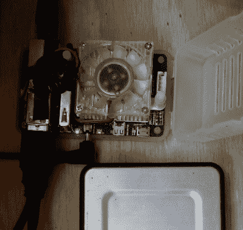
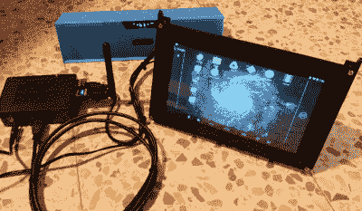
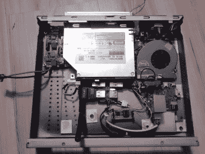

# hack let 46–o droid 项目

> 原文：<https://hackaday.com/2015/05/08/hacklet-46-odroid-projects/>

似乎这些天你一提到树莓派就有人提起 Odroid。以 Open 和 Android 的组合命名，当前的 Odroid 品牌涵盖了几款主板——U3、配备 2 Ghz 三星四核处理器的 UX3，以及直接针对我们最喜欢的水果派电脑的 C1。如此受欢迎，人们会期待一些基于 Odroid 机器的令人敬畏的项目，你是对的！本周的 Hacklet 都是关于在 [Hackaday.io 上使用 Odroid 的项目！](https://hackaday.io)

 我们先从【赫尔卡米】和[克罗诺斯](https://hackaday.io/project/4359)说起。克洛诺斯出生时是罗比·朱尼尔，Radio Shack 的翻版 Takara Tomy 的 Omnibot Jr. [herrkami]用 Odroid U3 升级了克洛诺斯的大脑。由于谷歌语音识别引擎和附带的 Python API 的一点帮助，克洛诺斯现在可以可靠地响应语音命令。克洛诺斯也很健谈，这都归功于 AIML 的框架。[herrkami]希望一旦他让 cut 斯芬克斯启动并运行，就切断电线(或 WiFi 链接)。[Herr kami]的一些最佳作品是在他的纸板模板中创造了一种让克洛诺斯转向的机制。对于一个 1986 年的老式机器人来说，这些都是非常可爱的更新！

 接下来是【tlankford01】搭配 [Linux 教程:o droid U3 Server w/sea file Cloud](https://hackaday.io/project/2290)。[tlankford01]指导我们使用 Odroid、16 GB EMMC 卡和保存文件的硬盘来设置文件服务器。正如所料，本教程涵盖了 LAMP (Linux、Apache、MySQL、PHP)服务器栈。9 个项目日志将我们从一个裸 microSD 卡带到一个完整的服务器。Odroid 的 2gb 内存在运行开源的 Seafile 云服务器包时得到了很好的利用。像这样的教程值得 Hackaday.io 社区的热爱。有时，您只需要启动并运行一个可靠的文件服务器。当这种情况发生时，这种类型的项目往往正是医生所要求的！所以不要做潜伏者，去[【tlankford 01】的页面](https://hackaday.io/Toby)给他一个脑壳！

 【维克多】让我们离拥有 [HDMI 触摸屏](https://hackaday.io/project/3558)的 Odroid 平板电脑又近了一步。HDMI 触摸屏是一个将带有电容式触摸屏的 7”1024 x 600 LCD 连接到基于 HDMI 的计算机的项目。该项目的核心是德州仪器的 [TFP401](http://www.ti.com/product/tfp401) panelbus DVI 接收器芯片。这种芯片使得 LCD 屏幕与 HDMI 或 DVI 视频卡的接口(几乎)没有痛苦。仍然有一些 X 配置要做，以使事情运行。[Victor]甚至通过自定义屏幕设置让他的 Odroid 在 Android 上运行。我们这些花时间在显示输入配置文件 limbo 人知道这不是一件小事！

 终于我们有了【达斯 _ 利亚马赫】与 [Odroid-U3 HTPC](https://hackaday.io/project/5270) 。[达斯]翻遍了他的垃圾箱和零件抽屉，用 Odroid-U2 打造了一台坚固的家庭影院电脑。U2 比目前的 U3 型号稍旧，但所有[达斯]的工作应该适用于任何 Odroid 系列。一个旧的 Itona 案例为这个黑客提供了框架，但它需要大量的塑料和环氧树脂定制工作才能使一切都适合。[Darth 的]软件栈是流行的 OpenELEC Linux 版本。[Darth]甚至使用连接到 USB 的 ATtiny85 和 s Adafruit 的 TrinketHidCombo 库设置了一个真正的“软”电源按钮。

如果你想在一个地方看到所有的 Odroid 项目，请查看我们新的 [Odroid 项目列表！](https://hackaday.io/list/5674-odroid-projects)

一如既往，这篇文章就到这里，下周见。同样的黑时间，同样的黑渠道，带给你最好的 [Hackaday.io！](http://hackaday.io/?utm_source=hackaday&utm_medium=29&utm_campaign=hacklet)