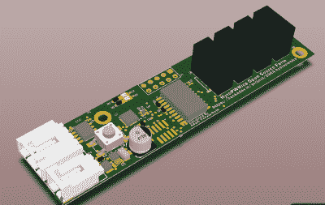
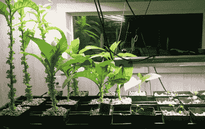
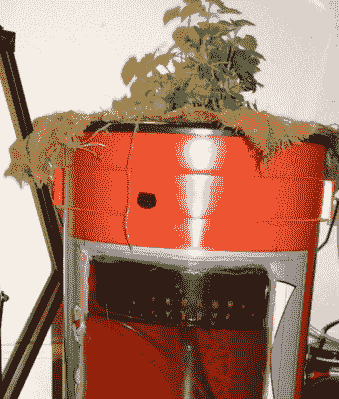
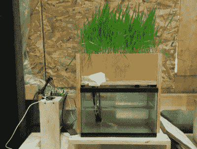

# hack let 50–水培项目

> 原文：<https://hackaday.com/2015/06/06/hacklet-50-hydroponic-projects/>

几个世纪以来，在没有土壤的情况下种植植物一直让人们惊叹不已。第一次出现在 17 世纪，水培已经成为一个产业，有许多技术来发芽和维持植物和动物的生命。难怪黑客、制造商、工程师和科学家几个世纪以来一直在研究和改进水培系统。水培植物生长是一个你可以真正投入进去的项目，因为没有什么比吃你劳动所得的水果和蔬菜更甜蜜的了。本周的 Hacklet 是关于 Hackaday.io 上最好的水培项目！

 我们从 2015 年 Hackaday 奖的【亚当·瓦达拉-罗斯】参赛作品开始。[Adam]正在创建一个通用系统，它可以与水培和土壤种植系统一起工作。水培装置将由 PVC 水槽系统中的植物组成。水将被抽到顶部的排水沟，并通过重力向下流经植物根部，回到水库。该系统将由 DyIO 控制器监控。感谢[mad.hephaestus]创造了 [DyIO](https://hackaday.io/project/3185) ，这个项目在 Hackaday.io 社区中得到了重用！

 接下来是【贾斯汀】和[一个农业](https://hackaday.io/project/4686)，一个自动化的水培花园。农业是水产养殖系统，这意味着它利用植物和鱼类之间的共生关系来生产更多的食物供人类食用。这种情况下的鱼是蓝鳃和牛头鱼。树莓 Pi 控制系统，而 Teensy-LC 用于帮助完成一些实时任务，如监控 PH 探针。[贾斯汀]甚至使用二氧化碳罐来控制溶解气体。他一定做对了什么，因为他的西红柿现在已经超过 23 英寸高了！

【Em】为我们带来 [5g 水培](https://hackaday.io/project/4346)。5g aquaponics 不是下一代蜂窝系统，也不是 5.8 GHz WiFi 设置，它是一个装在 5 加仑桶中的 aquaponics 系统。任何来自美国的人都会认出家得宝的橙色“荷马桶”。5g Aquaponics 包括一个窗口，允许监控水下工作。说到监控，5g aquaponics 是一件手动的事情-[ Em]在这里没有使用任何电子设备。这个想法是为那些刚接触水力/水生栽培的人创造一个易于安装和运行的系统。[Em]正在使用双区域根系统。这种植物生长在粗麻布的泥土中。然后将织物放在水浴中，水浴中也有鱼。通过通风石泵入的空气保持了所有东西的循环。这个项目的最初版本做得有点太好了。番茄长得太大了，根部把鱼勒死了！希望动植物都对这个新的 2.0 版本感到满意！

 最后，我们有了【基贾尼种植】和[智能水生植物](https://hackaday.io/project/1877)，这是【基贾尼的】2014 年 Hackaday 奖的参赛作品。人们不会想到鱼、植物和 Linux 会混合在一起，但这正是这里正在发生的事情。Linux 运行在流行的 Wr703n 路由器上，而定制的 ATmega328 Arduino 兼容板跟踪传感器。该系统的第二个版本将在一个 ATmega2560 和一个 AR9331 模块上运行，所有这些都位于一个电路板上。该系统确实有效，它已经从一个单独的鱼缸扩大到一个大型的防洪/排水台，配有生长灯，所有这些都保存在[Kijani 的]办公室里。[Kijani]遇到的最大问题是一些小问题，比如伪装成内核错误的放错位置的电阻。

还没吃你的蔬菜吗？想看更多水培项目？查看我们新的[水培项目列表！](https://hackaday.io/list/6136-hydroponic-projects)本周的 Hacklet 到此为止，一如既往，下周见。同样的黑客时间，同样的黑客频道，带给你最好的 [Hackaday.io！](https://hackaday.io/)