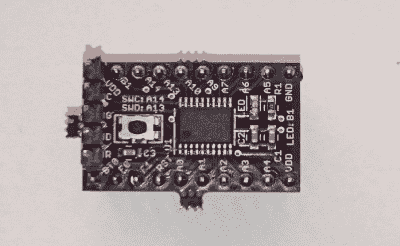
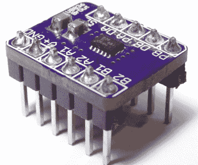
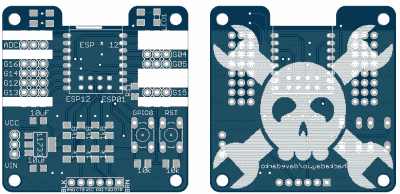
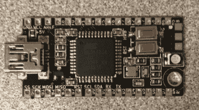

# hack let 52–分组讨论板项目

> 原文：<https://hackaday.com/2015/06/19/hacklet-52-breakout-board-projects/>

用新零件开始设计可能很难。它需要什么样的电源电压？有任何支持组件要求吗？足迹是什么？I/O 电压水平如何？分组讨论板旨在为您解答所有这些问题。当您使用新器件进行设计时，分组讨论会很有帮助，无论是微控制器、传感器、电机驱动器还是其他器件。当你试图快速破解一个程序，并且只需要让一些东西快速工作时，它们也是一个巨大的帮助。快速集成，通常试验板友好，突破只是使事情更容易！本周的 Hacklet 是关于 [Hackaday.io 上一些最好的分线板项目！](https://hackaday.io)

 我们先从【Christoph】和 [STM32F030F4P6 分线板](https://hackaday.io/project/4277)说起。受 Teensy 3.0 的启发，[Christoph]着手为 ARM 处理器构建一个简单易用的小型分线板。STM32F030F4P6 是一个很好的起点。只有 20 个引脚，是目前最小的 ARM 芯片之一。他添加了启动这个芯片所需的基本东西:去耦电容、复位按钮、ST 软件调试器的头部，当然还有一个 blinky hello world 程序的 LED。由此产生的董事会是物理微小的，但这个小人手臂板包 Coretex M0 动力冲床！

 接下来是【al1】和 [DRV8836 突围](https://hackaday.io/project/5753)。迟早，每个人都想在他们的一个项目中驱动电机。这是一种成年礼，就像闪烁 LED 一样。尽管电机消耗大量电流，但外部晶体管或驱动芯片几乎总是必不可少的。TI 的 DRV8836 芯片将两个全 H 桥封装在一个封装中。这足以驱动两个 DC 电机或一个步进电机。在一个小封装中处理每个驱动器 1.5 安培的电流意味着热耦合非常重要。DRV8836 有一个很大的散热垫，必须焊接才能防止烟雾进入。[al1]将芯片、正确的散热尺寸和去耦电容放在一个简单的分线点上。其结果是易于大众使用的电机驱动器。

 Hackaday.io 超级用户【davedarko】从他最喜欢的设计中获得灵感，创造了[忽略这个 ESP8266 板](https://hackaday.io/project/5841)。用[戴夫]自己的话说，“我偷了所有人的东西。Adafruit 的 huzza、[Matt 的]分线板、[Al1s]板、NodeMCUs DevKit。”嘿[Dave]开源硬件中没有偷窃！只有带属性的设计重用，这正是你正在做的。[Dave ' s breakout 可以使用两种流行的 ESP8266 封装:ESP-01 和 ESP-12。他增加了电源、复位/编程按钮和所有重要的串行接口，以便与模块通信。通过在 BOM 中不包括昂贵的串行转 USB 芯片，串行使 dave 能够降低成本。无论如何，我们大多数人都有 FTDI 电缆(或克隆电缆)来回跳动。我们绝对喜欢这个上面的标志！

 终于我们有了【大的】跟 [uBBB 32u4](https://hackaday.io/project/3330) 。uBBB 32u4 是[BBB](https://hackaday.io/project/3077)的哥哥，这是[沃伦]参与的一个 Hackaday.io 项目。 [bbb](https://hackaday.io/project/3077) 采用 Atmel ATmega32u2 处理器。[大的那个]已经把 faimly 扩展到包括一个 ATmega32u4。如果你想知道，uBBB 代表 1.65 英寸 x 0.8 英寸的“微型裸机板”，这是一个微型板。它仍然设法包括让处理器快速启动和运行所需的一切。晶体、按钮、去耦电容和 LEDs 应有尽有。迷你 USB 连接器使与 ATmega 的通信变得轻而易举！

如果您想查看更多分组讨论板，请查看我们新的[分组讨论板列表！如果我忘记把你加入名单，j](https://hackaday.io/list/6364) [只要在黑客日给我留言就行了。这就是本周的 Hacklet，一如既往，下周见。同样的黑客时间，同样的黑客频道，带给你最好的](https://hackaday.io/adam) [Hackaday.io！](https://hackaday.io/)