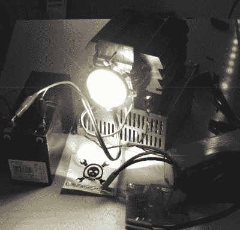

# hack let 69–莫尔斯电码项目

> 原文：<https://hackaday.com/2015/08/07/hacklet-69-morse-code-projects/>

拥有 160 多年历史的[莫尔斯电码](https://en.wikipedia.org/wiki/Morse_code)是迄今为止人类已知的最古老的数字信号系统。最初是为电报系统开发的，[塞缪尔·莫尔斯的]电码已经通过电线、无线电、甚至闪光发送。纵观历史，黑客、制造商和工程师一直在使用莫尔斯电码。多年来，简单的密码键和练习振荡器是业余爱好电子产品的“hello world”。事实上，一家以销售莫尔斯钥匙起家的公司已经成为世界上最大的电子元件分销商之一。该公司仍保留着该项目的名称:Digi-Key。本周的 Hacklet 是关于 [Hackaday.io](https://hackaday.io) 上一些最好的莫尔斯电码项目！

 我们从【voxnulla】和[莫尔斯键 HID +丑黑](https://hackaday.io/project/7110)开始。在他最喜欢的旧货店找到一把旧钥匙。它满是灰尘，油腻腻的，由于某种原因被漆成医院绿色。一旦油漆和污垢被清除，原来的木板恢复，钥匙实际上看起来相当不错。[Voxnulla]然后决定把它变成一个 USB 人机接口设备(HID)，模仿他的计算机的键盘。Arduino 通过 USB 将敲击键盘的莫尔斯电码字符转换成击键。正如[voxnulla]所知，当[蝴蝶不可用](https://xkcd.com/378/)时，真正的程序员用莫尔斯键驱动 vim！

 接下来是【Voja Antonic】与[爸爸，我没有钥匙](https://hackaday.io/project/6128)。如果你没有读过[Voja]关于[入侵数字和社交系统](https://hackaday.com/2015/08/03/hacking-the-digital-and-social-system/)的文章，那就去看看吧！许多公寓都有对讲系统，你必须“嗡嗡”地叫人进来，激活门上的电磁锁。[Voja]在扬声器和解锁按钮之间插入了一个微芯片 PIC12 系列微控制器。用户所要做的就是在大厅的呼叫按钮上敲出正确的莫尔斯电码密码。如果密码被接受，PIC 就会打开门，你就可以进去了！

【kodera 2t】凭借[独立微型莫尔斯电码编码器/解码器](https://hackaday.io/project/4294)将事物带入数字时代。这个项目源于他的通用目的[便携式微型物联网设备项目](https://hackaday.io/project/4201)。[kodera2t]为这个项目推出了自己的 Arduino 兼容板。由 ATmega1284 供电的微型计算机使他能够编码和解码莫尔斯电码。智能手机大小的键盘和小人国有机发光二极管显示器充当用户界面，而旋转编码器允许可变的代码速度。你甚至可以在一个触觉按钮上“敲击”莫尔斯电码！

 终于有了【Yannick (Gigawipf)】配[便携(morsing) 100W led 手电筒](https://hackaday.io/project/1789)。如今，100 瓦的 led 已经变得相当便宜，当你绝对肯定要让你周围的人失明时，它们是完美的。这些发光二极管还可以快速开关，这使得它们非常适合莫尔斯电码。在过去的几年里，机械快门必须被用来执行同样的壮举。[Yannick]使用 5000mAh 5S Zippy Li-Po 为这只饥饿的野兽提供电子，而 600 瓦的恒流升压转换器则保持对功率的控制。运行莫尔斯电码转换器软件的 Arduino 控制升压转换器和 LED。[Yannick]用他的电脑通过 Arduino 的串行链路发送一条信息，剩下的工作由灯来完成，让所有人都能看到这条信息。

如果你想要更多的莫尔斯的好处，看看我们全新的[莫尔斯电码项目清单](https://hackaday.io/list/7125-morse-code-projects)！我的莫尔斯有点生疏，所以如果我不能复制你的传输，错过了你的项目，不要犹豫[给我在 Hackaday.io](https://hackaday.io/adam) 上留言。这就是本周的 Hacklet。一如既往，下周见。同样的黑客时间，同样的黑客频道，带给你最好的 [Hackaday.io](https://hackaday.io/) ！