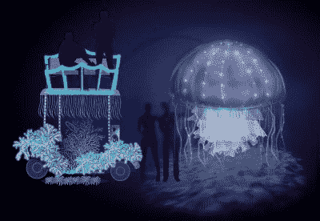
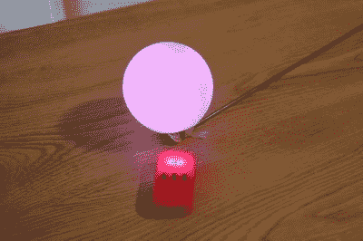
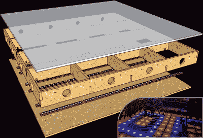
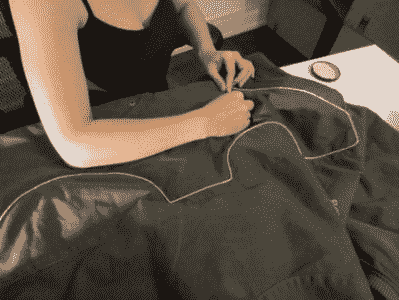
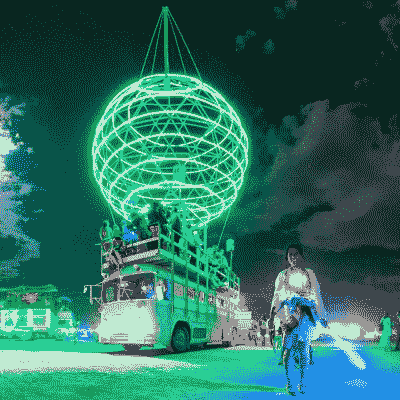

# hack let 72–燃烧人项目

> 原文：<https://hackaday.com/2015/08/28/hacklet-72-burning-man-projects/>

火男快到了！短短几天内，艺术家、黑客、创客和工程师将汇聚在内华达州北部的黑石沙漠。他们将忍受酷热、灰尘，可能还有一些虫子，来创造世界上最大的户外艺术节之一。每年，普拉亚都被艺术车、巨大的滚动驳船和覆盖着 RGB LEDs 的喷火动物所覆盖。有如此多的项目要做，难怪相当多的 Hackaday.io 成员(和 Hackaday 的员工)是燃烧者。本周的 Hacklet 是关于 [Hackaday.io](https://hackaday.io) 上一些最好的燃烧人项目！

 我们先从【大卫 Nghiem】和[《深渊》——DC 的声波水母艺术车](https://hackaday.io/project/4714)说起。看着一只发光的水母在黑暗的海洋中平静地漂浮，令人心平气和。[大卫]和他的团队正在沙漠深处重现这种效果。他们把一只巨大的水母挂在高尔夫球车前。美杜莎将用几码丝绸和其他类型的织物装饰起来，以创造一种流动的效果。照明将来自 8 个 RGB LED 灯，由 15 个小型液晶显示器控制。Teensys 会让灯光随着音乐的节拍闪烁。燃烧者可以在雕塑里跳舞，因为这种水母谢天谢地没有刺。

 自行车是火人节的首选个人交通方式。正如你可能想象的那样，在所有停放的自行车中找到你的自行车是相当困难的。鲍勃·巴德利(Bob Baddeley)用[琵琶鱼做自行车](https://hackaday.io/project/7293)让这变得简单了一点。真正的琵琶鱼有一个八角，这是一个顶端发光的茎，挂在它们的嘴前面。生物荧光引诱猎物上钩。[Bob]正在使用一个 RGB LED 发光球引诱他骑自行车。这条琵琶鱼出生于亚马逊，是一个闪闪发光的球体。[Bob]拆除了原来的电子设备，并用他自己定制的 PCB 上的蓝牙无线电取代了它们。简单地按下一个按钮，球就会闪烁，引导[Bob]走向他的坐骑。

 接下来出场的是【杰瑞米】与[互动迪斯科舞池](https://hackaday.io/project/4209)。受《周六夜狂热》和比利·简的音乐视频的启发，[杰里米]正在创造一个舞池，对在上面跳舞的人做出回应。地板由 80 米长的 5050 个 RGB LEDs 照明，由 ATmega168s 控制。ATmega168 连接到一个由铁丝网构成的电容传感器。该系统足够敏感，即使穿着厚厚的摩托车靴也能捡起脚。所有处理器通过 RS-485 网络连接到中央计算机。这允许计算机接管并驱动预编程的模式到地板上。PC 端的代码是用 JavaScript 写的，所以很容易修改。

 最后我们有 Hackaday.io 自带【茉莉】配[发光夹克](https://hackaday.io/project/451)。晚上在黑岩城走来走去会很危险。人们从一个派对跑到另一个派对，骑自行车的人飞过海滩，你永远不知道谁会撞上你！有一些东西可以确保你是可见的，这是一个项目的良好开端。在沙漠中的寒冷夜晚保持温暖将是一个额外的好处。[Jasmine]将 32 英尺长的电致发光(EL)线缝在黑色皮大衣的背面。电线连到藏在夹克里的两节 AA 电池供电的逆变器。最困难的部分是把所有的电线都缝到夹克上。然而，当所有的缝合工作完成后，她的丈夫(本)就像夜晚的灯塔一样闪闪发光。

燃烧者联合起来！【茉莉】已经将[黑客燃烧者](https://hackaday.io/project/7349)项目页面设置为所有燃烧者和燃烧人粉丝的聚集地。如果你感兴趣，就加入吧！如果你想看更多的燃烧人项目，我已经为你准备好了我们新的[燃烧人项目列表](https://hackaday.io/list/7458-burning-man-projects)。如果我错过了你的项目，请不要犹豫[在 Hackaday.io](https://hackaday.io/adam) 上给我留言。这就是本周的 Hacklet。一如既往，下周见。相同的黑客时间，相同的黑客频道，带给你最精彩的 [Hackaday.io](https://hackaday.io/) ！