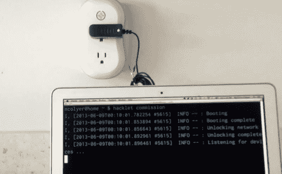

# Hacklet 为 Modlet 智能插座添加了 Linux 控件

> 原文：<https://hackaday.com/2013/07/27/hacklet-adds-linux-control-for-the-modlet-smart-outlet/>

Linux 用户现在有一个简单的选项来控制 Modlet 智能插座。Hacklet 是一个 Ruby 脚本，它可以从 Modlet 中切换和读取状态信息。

这是我们第一次听说 [Modlet](http://www.themodlet.com/) 。这是远程控制电器的又一次尝试。与 [WeMo](http://hackaday.com/2013/01/31/turning-the-belkin-wemo-into-a-deathtrap/) 将一个插座的控制放在 WiFi 上不同，Modlet 使用 USB 加密狗来无线控制两个插座。它还有一个额外的好处，就是可以读取每个插头使用了多少电流。这意味着你需要一台带 USB 加密狗的电脑来控制它。但是像 Raspberry Pi 这样的廉价嵌入式系统使得这在前期成本和保持其一直运行的价格上都不是问题。

[Matt Colyer 的]演示视频包括 60 美元入门套件的开箱。上面看到的屏幕显示了他的脚本与插座的配对。它继续演示切换它的命令，并从设备中提取数据。他甚至提供了一个例子来说明如何通过脚本使用 IFTTT。

[https://www.youtube.com/embed/rTn9QfW8NS8?version=3&rel=1&showsearch=0&showinfo=1&iv_load_policy=1&fs=1&hl=en-US&autohide=2&wmode=transparent](https://www.youtube.com/embed/rTn9QfW8NS8?version=3&rel=1&showsearch=0&showinfo=1&iv_load_policy=1&fs=1&hl=en-US&autohide=2&wmode=transparent)