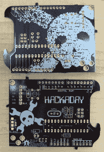
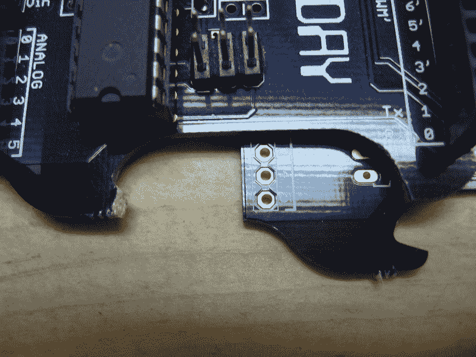

# 使用 Arduino 打开你的啤酒

> 原文：<https://hackaday.com/2013/10/11/haduino-open-your-beer-using-arduino/>

坦白地说，我们厌倦了 Arduino 在 Hackaday 的坏名声。所以[Brian Benchoff]想出了一个方法，让它对更广泛的受众有用。他的发明，我们称之为 HaDuino，可以让你用 Arduino 克隆体打开一瓶美味的啤酒。

[https://www.youtube.com/embed/nrahtW_ET8o?version=3&rel=1&showsearch=0&showinfo=1&iv_load_policy=1&fs=1&hl=en-US&autohide=2&wmode=transparent](https://www.youtube.com/embed/nrahtW_ET8o?version=3&rel=1&showsearch=0&showinfo=1&iv_load_policy=1&fs=1&hl=en-US&autohide=2&wmode=transparent)

这是一块非常漂亮的板子。点击左边的图片可以看到高分辨率的图像。[Brian]在电路板背面的像素化徽标方面做得非常出色。顶部包括他的一些尖刻的评论，以帮助您填充组件。当心芯片两侧的去耦电容。我们认为，如这些足迹所示，使用 1k 电阻可能不是个好主意。布莱恩的编辑:我把标签搞砸了。它们在当前版本中被修复了)这不是设计中唯一的错误，所以请确保你继续阅读。

你的眼睛很可能已经挑出了开放的硬件标志。我们喜欢将开源作为一个核心概念，并且已经[在我们的 GitHub 库中提供了设计文件](https://github.com/Hack-a-Day/HaDuino)。用 Git 跟踪硬件很奇怪，但是如果你打算在主板上做手脚，我们会很高兴你这样做，以便其他读者(包括我们)可以看到你想出的很酷的东西。

### 这是一场闹剧

尽管我们很喜欢这个想法，但 PCB 在打开一瓶啤酒后就坏了。上图显示了破损的填充板，旁边是一个原始副本。但是因为我们认为这个想法很搞笑，所以我们继续制作这个视频。所有三个演示瓶的瓶盖在拍摄前都是“松开”的。事实上，在一些照片中你可以看到钥匙链上有一个开瓶器。当我们说漏嘴的时候，这些瓶子里甚至没有啤酒。我们简单地在空瓶子里装满水，并用黑色的盖子盖上，你也可以在一些照片中看到。我们这样做是因为我们没有在中午喝酒的习惯。最重要的是，这甚至不是一个 Arduino 克隆，因为我们通过在 ATmega168 上编程裸机来使灯光闪烁。

但是废话少说。可以可靠地打开一瓶啤酒的 PCB 形状的概念并不那么遥不可及。我们认为部分问题是缺少一个合适的支点。此外，需要设计更坚固的突起来锁定在盖子的下侧。因为设计文件是可用的，这只是尖叫着找人黑出一个更好的版本。你还在等什么？