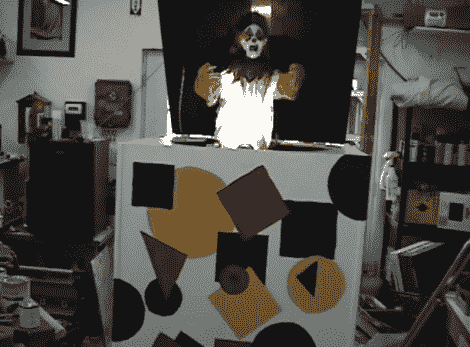

# 万圣节道具:盒子里的食尸鬼上演了一场精彩的表演

> 原文：<https://hackaday.com/2012/10/29/halloween-props-ghoul-in-the-box-puts-on-a-pretty-good-show/>

 

盒子项目中的食尸鬼拥有经典万圣节道具的所有元素。他为去年的展览建造了它，但是我们确信它将会是永久的最爱。

顾名思义，它是仿照盒子里的杰克玩具设计的。恰当地说，它用明亮、快乐的颜色装饰，并在盒子的右侧包括一个曲柄。但是你不需要任何人力来使它工作。隐藏在前面板中央的红色圆圈中的是一个运动传感器。走到盒子前面，就会触发两种模式中的一种。曲柄开始转动，黄鼠狼开始愉快地演奏 *Pop。但是当歌曲接近尾声时，节奏变慢，音调下降，好像失去了动力。这是里面的食尸鬼蓬勃发展的完美伏笔。*

休息后的演示让您看到了操作，以及构建中使用的组件。

[https://www.youtube.com/embed/2mDk8ftIWlw?version=3&rel=1&showsearch=0&showinfo=1&iv_load_policy=1&fs=1&hl=en-US&autohide=2&wmode=transparent](https://www.youtube.com/embed/2mDk8ftIWlw?version=3&rel=1&showsearch=0&showinfo=1&iv_load_policy=1&fs=1&hl=en-US&autohide=2&wmode=transparent)