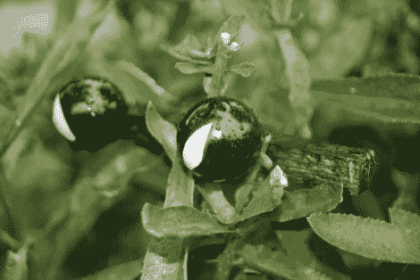

# 万圣节道具:幽灵般的眼睛照亮了灌木丛

> 原文：<https://hackaday.com/2012/10/19/halloween-props-spooky-eyes-light-up-the-bushes/>

这只是今年万圣节几双幽灵般的眼睛照亮灌木丛的一个例子。快速和廉价的建造过程使它成为一个完美的 diy 装饰。

每只眼睛由一个乒乓球和一个 LED 组成。但是仅仅这样并不会很吓人，因为整个球会发出相当明亮的光。因此，他通过遮盖一个瞳孔的形状并将球喷成黑色来增加一些趣味。上面白色的垂直裂缝会在夜晚像恶魔一样发出红光。

led 由运行 Arduino 引导程序的 ATtiny85 驱动。[Vato]发现有足够的空间编写代码，使用 PWM 淡入淡出眼睛。这种情况在他驾驶的四对赛车中随机发生。

我们已经看到一个类似的项目，[使用超大尺寸的 led 作为眼睛](http://hackaday.com/2011/08/20/glowing-eyes-project-keeps-it-simple-this-halloween/)。但是我们真的很喜欢使用像这样的扩散器。休息之后看看它的实际效果。

[https://player.vimeo.com/video/51676389](https://player.vimeo.com/video/51676389)