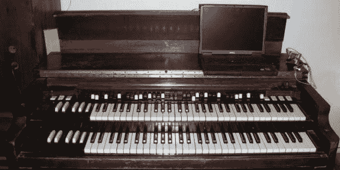

# 哈蒙德风琴发出的信息可以被声谱图解码

> 原文：<https://hackaday.com/2013/03/28/hammond-organ-sends-messages-which-can-be-decoded-by-a-spectrogram/>

这是一个古老器官的有趣用途。让它进入你的业余无线电行动。[福里斯特·库克]正在展示他的项目，该项目使用[一个哈蒙德风琴对信息进行编码，这些信息可以通过声谱图显示](http://www.solorb.com/elect/hamcirc/tonewriter/index.html)。我们以前见过这种[类型的信息编码](http://hackaday.com/2011/05/26/hidden-messages-in-audio/)(只是不涉及乐器)。以[的形式出现的 fldigi 程序](http://www.w1hkj.com/beginners.html)相当受火腿们的欢迎。

Arduino 通过 UNL2003 达林顿阵列芯片连接到风琴。这个芯片正在驱动一些簧片继电器，这些继电器使风琴连接起来，产生正弦波音调。有了硬件，接下来就是格式化数据以生成目标音频。[Forrest]编写了自己的 Arduino 草图，它从串行端口(由笔记本电脑通过 USB 推送)获取字符，然后映射到存储的 5×7 字符字体集，然后驱动引脚产生音调。正如你在片段中看到的，在休息之后，产生的音频可以变成非常可读的文本。

[https://www.youtube.com/embed/mHCpkBAaRQo?version=3&rel=1&showsearch=0&showinfo=1&iv_load_policy=1&fs=1&hl=en-US&autohide=2&wmode=transparent](https://www.youtube.com/embed/mHCpkBAaRQo?version=3&rel=1&showsearch=0&showinfo=1&iv_load_policy=1&fs=1&hl=en-US&autohide=2&wmode=transparent)