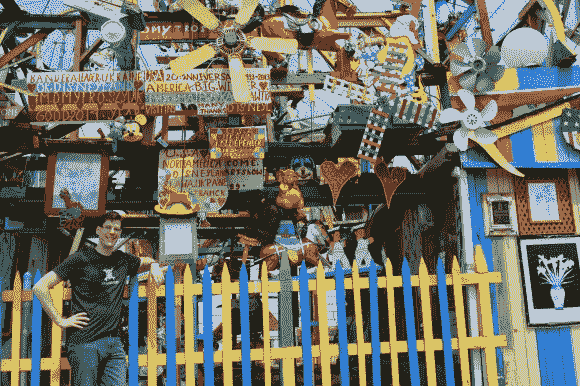
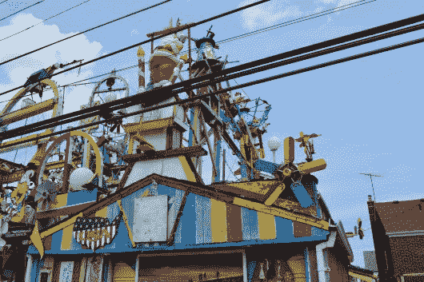
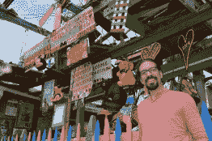
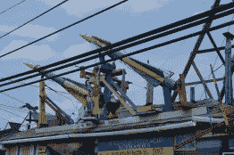
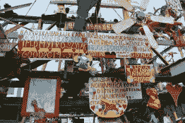
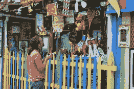
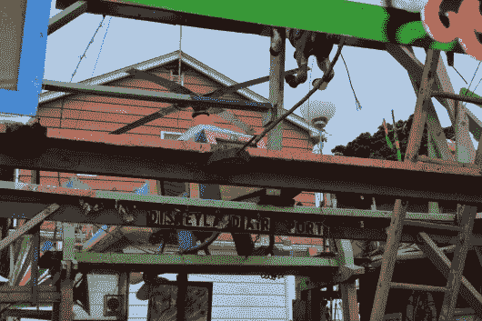
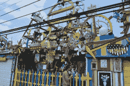
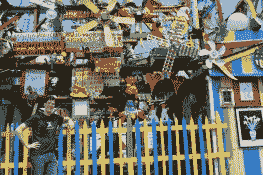
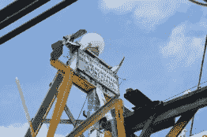

# 哈姆川克迪斯尼乐园

> 原文：<https://hackaday.com/2014/07/11/hamtramck-disneyland/>

几个小时的休息时间，我说服了 Caleb Kraft 和我一起去 Hamtramck 迪斯尼乐园。你听说过吧？我当然没有。当【克里斯·汤普森】[向我们建议的时候](https://twitter.com/eagleApex/status/486916001154752513)，我听起来像是胡言乱语。这里距离[废品回收中心仅 10 分钟车程！](http://www.recyclehere.net/)(正在举行红牛创作的地方)。

没有街道地址，我们永远也找不到它。这个奇观只是密歇根州哈姆川克一条普通街道上的一栋房子。我们就在几个门外，沿着街道爬行，然后发现房子之间有一道闪光。转过街角，拐进小巷，这个奇迹向我们敞开了大门。[Dmytro Szylak]的工作开始于大约 20 年前。他建了又建，建了好几年，创造了一些后院艺术，如果不开心的话是不可能看到的。你不会在那里花太多时间，但是亲自去看看还是值得的。对于那些永远不会有机会的人，这里是我抓拍的照片。

  Even Old Saint NIck gets included in the action.  Caleb posed for a photo  Rockets!  This is one of at least two ceiling fans repurposed as (non-functional) windmills  Caleb reading the signage  There’s a bizarre helicopter hidden nearer the house  Pretty much everything is anchored to the garage which faces the alley.  Mike posing near the central part of the build… lots to see here!  The sign high atop the exhibition.