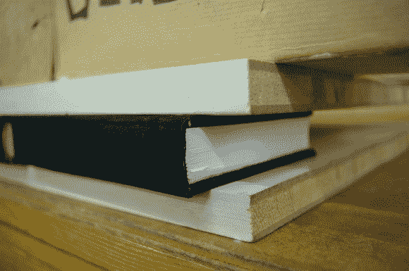

# 手工装订你自己的书

> 原文：<https://hackaday.com/2013/01/29/hand-bind-your-own-books/>

这本指南将向你展示如何手工装订书籍。只要你一步一步地走下去，从开始到结束的过程并不难。最终产品看起来很棒，我们想不出更好的礼物了…只要你在页面上有一些有意义的东西。

我们从未真正考虑过纸张中纤维的方向，但这是你在这里必须考虑的第一件事。当书在书架上时，你希望纤维上下运动。接下来，这些纸被分成四叠，然后对折成八页。将这些包装叠放在一起后，在折叠面上标出一系列线。然后用一根结实的针从每个标记的内侧打孔。这是装订的缝合处。带子是用粗线加的。在将它们缝合到位并打结后，加入胶水，最后将一块布粘在装订边和每个内封面的一部分上。从那里开始制作封面，然后按下完成的项目，如上所示。多好的作品啊！

[via [Reddit](http://www.reddit.com/r/DIY/comments/17dddy/guide_on_how_to_craft_a_book_xpost_from_rpics/)