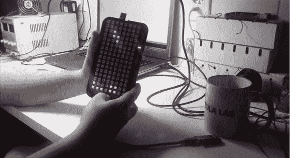

# 手持俄罗斯方块是复古的，我们喜欢它

> 原文：<https://hackaday.com/2014/03/18/handheld-tetris-is-retro-and-we-love-it/>

[Eduardo Zola]一直在玩 Arduinos，自从他开始以来，他就想尝试制作一款游戏。带着在 Windows 3.1 上玩俄罗斯方块的美好回忆，他决定[尝试一下它的手持版本。](https://www.youtube.com/watch?v=Mn1iOMAMRw8)

他从两个 8×8 Neopixel 矩阵开始，因为它们很简单——更不用说大量可用的代码库了！为了使它真正便携，他还包括一个 3.7v 4400mAh 锂离子电池，可以让他玩几个小时的游戏。他在易贝身上发现了一个组成操纵杆的五向导航开关。一个小的 LED 条显示告诉你你在哪个级别，他甚至包括一个更小的音乐扬声器，和一个振动马达，用于成功完成游戏中的线条！

他从[瓦伦丁·伊万诺夫]的[源代码](http://www.breakcontinue.com/2013/09/rgb-123-16x16-and-arduino-mega-playing.html)中借鉴了俄罗斯方块算法(并添加了一些改进)，后者去年秋天完成了一个类似的项目。留下来看看它的演示视频。

[https://www.youtube.com/embed/Mn1iOMAMRw8?version=3&rel=1&showsearch=0&showinfo=1&iv_load_policy=1&fs=1&hl=en-US&autohide=2&wmode=transparent](https://www.youtube.com/embed/Mn1iOMAMRw8?version=3&rel=1&showsearch=0&showinfo=1&iv_load_policy=1&fs=1&hl=en-US&autohide=2&wmode=transparent)

尽管如此，我们还是很喜欢这个玩 LED 领带的俄罗斯方块