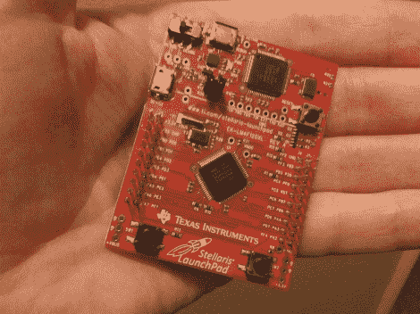

# 手放在 Stellaris 发射台上

> 原文：<https://hackaday.com/2012/09/27/hands-on-the-stellaris-launchpad/>

我们刚刚得到了一个 Stellaris 发射台。当预订最初被宣布的时候，我们已经下了订单，但是 TI 的营销人员主动给我们提前发了一份订单，并接受了他们的邀请。我们在休息后嵌入了一个快速拆箱的视频，但请继续阅读一些没有包含在该剪辑中的信息。

该板及其包装的外观和感觉几乎与 MSP430 版本的 Launchpad 完全相同。但是为什么不呢？毕竟第一次效果很好。该主板搭载 ARM Cortex-M4 处理器。底部的两个按钮是用户按钮，右上角的是重置按钮。板的顶部是编程器，有一个微型 USB 端口用于连接。该套件还包括用于此连接的大约 2 英尺长的电缆。在那个插孔旁边是一个选择电源的开关。您还会注意到左侧有一个 USB 端口，这是因为处理器包含 USB 功能，TI 提供了一个免费库。电源可以来自编程器/调试器 USB 端口，或者来自该设备 USB 端口。主板正面的两侧都有双引脚接头，背面有引脚插座，用于断开处理器的引脚。重置按钮下方是一个 RGB LED，芯片上方还安装了一个时钟晶体。

当通过编程器的 USB 端口插入时，PWR LED 会像 RGB LED 一样亮起。设备自带的固件会在一系列颜色中渐变，用户按钮会在一组预定义的颜色中滚动。设备在我们的机器上枚举为:“Bus 002 Device 005:ID 1c be:00fd Luminary Micro Inc .”。但如果通过设备 USB 插孔连接，它会枚举为:“总线 001 设备 015: ID 04e8:689e 三星电子有限公司 GT-S5670 [Galaxy Fit]”。有意思。

我们不知道是否有编程工具可以使用 Linux 操作系统来刷新电路板，但是我们会努力解决这个问题。如果你有一些信息，请在评论中分享。

[https://www.youtube.com/embed/uCdEcGQltZA?version=3&rel=1&showsearch=0&showinfo=1&iv_load_policy=1&fs=1&hl=en-US&autohide=2&wmode=transparent](https://www.youtube.com/embed/uCdEcGQltZA?version=3&rel=1&showsearch=0&showinfo=1&iv_load_policy=1&fs=1&hl=en-US&autohide=2&wmode=transparent)