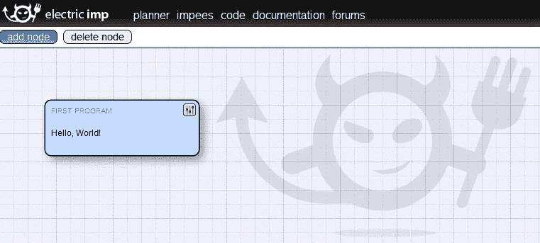

# 手动操作电动小恶魔

> 原文：<https://hackaday.com/2012/09/04/hands-on-with-the-electric-imp/>

不久前，我们听到了电动 Imp T1 的风声，这是一个非常酷的小设备，将 ARM 微控制器和 WiFi 适配器集成到 SD 卡中。上周我们得到了一个小精灵，现在是时候展示这个小装置能做什么了。休息之后，你可以用电动小精灵来看看这个动手教程的其余部分。

[https://www.youtube.com/embed/g42Tt5HUZao?version=3&rel=1&showsearch=0&showinfo=1&iv_load_policy=1&fs=1&hl=en-US&autohide=2&wmode=transparent](https://www.youtube.com/embed/g42Tt5HUZao?version=3&rel=1&showsearch=0&showinfo=1&iv_load_policy=1&fs=1&hl=en-US&autohide=2&wmode=transparent)

抱歉用土豆拍了这个。

为了充分披露，我自掏腰包支付了我的 Imp 和 dev 板(Imp 25 美元，Hannah dev 板 25 美元，4 月板 7 美元)，但 Electric Imp 的[Kevin Fox]非常友好地将我推到了开发人员队伍的前面。

正如你所看到的，将一个电动小精灵连接到互联网是相当容易的，但是做一些*有用的事情*呢？为此，Electric Imp 有一个基于云的 IDE 来开发代码，并将其推送到互联网连接的 Imps。

当你第一次将你的电动 Imp 连接到互联网，并登录到电动 Imp“规划器”时，你会看到一个代表你的 Imp 和 dev 板的蓝框。在上图中，我有一个在 Imp 上运行的“Hello World”程序，它只是将一个文本字符串传递给云。在这种情况下，我的 Imp 已经将“Hello World”发送到了云端。

显示一行文本当然很好，但是有更多 I/O 的东西怎么样呢？点击计划器上方的“代码”链接，您可以为电动 Imp 编写自己的代码:

我为 Hannah 开发板使用了一段名为 [colorblink](http://devwiki.electricimp.com/doku.php?id=colorblink) 的示例代码。这没什么太复杂的。它使用 Hannah 上的 I2C 端口扩展器来循环几种颜色的 RGB LED。将代码上传到我的 Imp 是小菜一碟:

[https://www.youtube.com/embed/sj_OIJt3xKI?version=3&rel=1&showsearch=0&showinfo=1&iv_load_policy=1&fs=1&hl=en-US&autohide=2&wmode=transparent](https://www.youtube.com/embed/sj_OIJt3xKI?version=3&rel=1&showsearch=0&showinfo=1&iv_load_policy=1&fs=1&hl=en-US&autohide=2&wmode=transparent)

再次为土豆道歉。

好了，各位。一个无线的、基于云的微控制器平台，适合放在 SD 卡中。

就电动 Imp 而言，我要公开表示，它是一个功能与广告宣传完全相同的整洁硬件。不过，我必须指出，尽管电动 Imp 封装在 SD 卡中，但它不是 SD 卡。目前你无法将电动 Imp 插入连接到 Arduino(或其他微控制器平台)的 SD 卡插座，并让它像 [Eye-Fi](http://www.eye.fi/) 一样工作。

在[电动 Imp 开发 wiki](http://devwiki.electricimp.com/doku.php?id=newimpee) 上有大量关于必要支持硬件的信息，令人惊讶的是 Imp 并不需要太多。将 SD 卡插座转变为电子 Imp 硬件的唯一必要部件是一个连接到 Imp 上的第 6 号插脚的[小型加密芯片](http://www.atmel.cimg/doc8740.pdf)。该芯片为电子设备/云环境提供必要的识别。这使得你可以很容易地将电动 Imp 添加到你想做的任何项目中。

在这个简短的教程中，我还没有涵盖很多内容，包括将数据从 Imp 的云环境推送到您的服务器(从而使 Imp 可以用作无线传感器平台)，或者将 Imp 连接到为我听说的“物联网”设计的其他硬件。我将在本月晚些时候开始做一些演示。

对我来说，我对 Imp 只有两个问题:首先，电动 Imp 需要使用电动 Imp“云”我真的希望看到另一个 Imp 开发者想出一种方法来运行我自己的 Imp 云，或者简单地编程一个 Imp 来与非 Imp 服务器一起工作。

其次，而且我觉得有必要重申这一点，*电动 Imp 不是 SD 卡*。电动 Imp 不提供存储；它只是一个小小的微控制器平台，一个 WiFi 适配器被塞进了 SD 卡的外壳。

我查阅了电动 Imp 的文档，发现写入 SD 卡所需的所有引脚都可以作为 GPIO 引脚使用。这让我相信，或许可以编写一些代码来模拟 SD 卡，让 Imp 充当微控制器和服务器之间的隐形桥梁。是的，也许有可能把电动小精灵变成一只眼睛，但是不要引用我的话。

简而言之，Electric Imp 真的很酷，它做了所有宣传的事情，并展示了支持 WiFi 的构建的巨大潜力。我将对此进行更多的探讨，并向 Hackaday 读者提供最新消息。