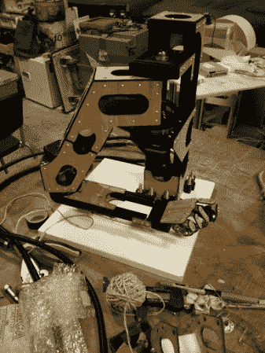

# 手写机器人手臂有点僵硬

> 原文：<https://hackaday.com/2013/03/27/handwriting-robot-arm-is-a-little-stiff-wristed/>

看看这个能够书写的机器人手臂，它比我们自己的要清晰几个数量级。它是由[帕特里克·巴恩斯]建造的，作为为杜氏肌营养不良症的研究筹集资金的活动的合同工程。

不要错过休息后的视频，它以一些严重的步进电机令人满意的呜呜声开始。从这张图片判断比例有点困难，但[Patrick]告诉我们，整个组件几乎有 14 英寸高，手臂大约有 20 英寸长。演示通过画一条希尔伯特曲线来展示它的能力。从观看动作你会意识到，虽然这个手臂和手看起来很棒，但这实际上是一个 SCARA 绘图仪。手腕和手指只是为了看起来，提供一个可以安装毡尖笔的地方(用橡皮筋固定在纸上)。无论这是否令人失望，机器的精度和外观都给它带来了很高的分数。不过，我们可以从另一个我们见过的人那里学点书法[。](http://hackaday.com/2013/03/08/handwriting-suck-build-a-machine-to-do-it-for-you/)

[https://www.youtube.com/embed/B-EFDt3eXv4?version=3&rel=1&showsearch=0&showinfo=1&iv_load_policy=1&fs=1&hl=en-US&autohide=2&wmode=transparent](https://www.youtube.com/embed/B-EFDt3eXv4?version=3&rel=1&showsearch=0&showinfo=1&iv_load_policy=1&fs=1&hl=en-US&autohide=2&wmode=transparent)