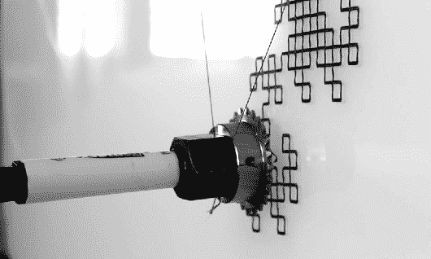

# 带颜色扭曲的悬挂绘图仪

> 原文：<https://hackaday.com/2013/12/10/hanging-plotter-with-a-color-twist/>

威斯康星大学的机械工程师杰克·博兰(Jack Boland)构建了一个很酷的[悬挂式绘图仪项目，名为 HangBot](http://bolandcommajack.com/engineering/the-hangbot-project/) 。这是一个相当标准的设置，他将图像转换成 g 代码文件，并使用两个步进电机进行控制。在之前，我们已经见过垂直绘图仪[，但是它们往往只有一支笔。[Jack]将这个扩展为](http://hackaday.com/2012/11/16/raspberry-pi-driven-polargraph-exhibits-high-precision-drawing-ability/)[通过将图像分割成单独的 CMYK 层，并将每一层绘制到单独的透明胶片上，将颜色融入混合画面](http://bolandcommajack.com/engineering/the-hangbot-project/cmyk/)。当叠加时，它们产生接近全彩色图像的东西。他的想法是用这种装置来代替典型的橱窗标牌。

因为它画的是一条连续的线，他似乎在使用网格而不是传统的点状图案。再加上记号笔笔尖的不准确，分辨率将受到限制。尽管如此，你可以从这张(虽然模糊)照片中看出他已经有了一个很好的开始。休息之后看看它的运行视频。

<http://vimeo.com/moogaloop.swf?clip_id=65686401&amp;force_embed=1&amp;server=vimeo.com&amp;show_title=1&amp;show_byline=1&amp;show_portrait=0&amp;color=00adef&amp;fullscreen=1&amp;autoplay=0&amp;loop=0>

<http://vimeo.com/moogaloop.swf?clip_id=65686401&amp;force_embed=1&amp;server=vimeo.com&amp;show_title=1&amp;show_byline=1&amp;show_portrait=0&amp;color=00adef&amp;fullscreen=1&amp;autoplay=0&amp;loop=0>

[‘hang bot’机器人在](http://vimeo.com/65686401) [Vimeo](https://vimeo.com) 上绘制来自[武钢研究院](http://vimeo.com/widiscovery)的图像和数据。