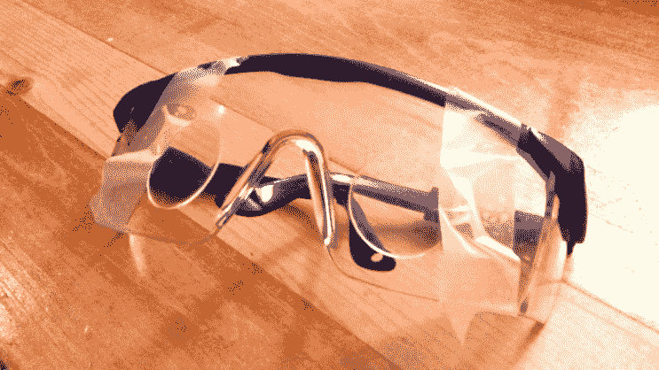

# Happy Meal Hack 制作了一个谷歌纸板测试

> 原文：<https://hackaday.com/2014/12/03/happy-meal-hack-produces-a-google-cardboard-test/>

自从谷歌 Cardboard 问世以来，[朱利安·杰克逊]就一直想尝试一下。负担得起的虚拟现实？谁不会！但是，他从来没有抽出时间来做这件事——直到有一天他和儿子坐在麦当劳里，向他解释最新的开心乐园餐玩具是如何工作的——那是一副企鹅望远镜。

感恩节和黑色星期五很快过去了，[朱利安]的儿子在兴奋中完全忘记了麦当劳玩具，所以[朱利安]问他是否可以拥有它。他的儿子有点困惑，但也很好奇，所以他让爸爸拿走了他的玩具。

在试图用螺丝刀拆下镜头后，[Julian]仔细计算了在不损坏镜头的情况下简单打碎它的最佳位置。他像心脏外科医生一样精准地挥回了他信赖的锤子

由于镜头的焦距太长(大约 6 英寸),最终的结果既不美观，也不实用。但这足以让[朱利安]玩玩谷歌纸板应用程序——这确实是他想做的一切。[开心乐园餐黑客](http://hackaday.com/tag/happy-meal/)应该差不多是自己的事吧？

更多功能版本的自制纸板套件，请查看我们最近的虚拟现实综述。