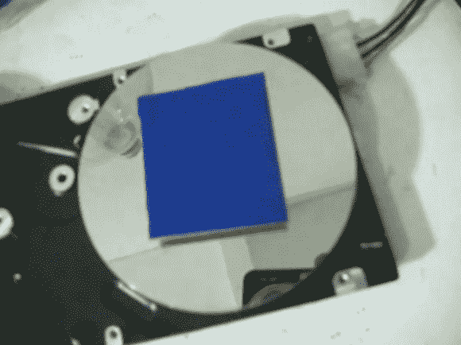

# 用于敏化覆铜板的硬盘离心机

> 原文：<https://hackaday.com/2013/03/09/hard-drive-centrifuge-for-sensitizing-copper-clad-boards/>

我们敢打赌，我们在这里看到的大多数家庭蚀刻 PCB 项目都使用墨粉转移法。但是下一个最受欢迎的技术是使用光敏油墨，这种油墨一旦暴露在光线下就能抵抗蚀刻酸。大多数人购买所谓的预感光板，但你也可以得到墨水来制作自己的。[Jardirx]这样做，[使用一个旧的硬盘驱动器来应用一层均匀的光敏墨水](http://www.youtube.com/watch?v=3ZCPjabxCrk)。

休息后发现的视频的旁白和字幕都是葡萄牙语，但不难看出这里发生了什么。他首先使用双面泡沫胶带将覆铜板固定到硬盘上。你会想尽可能地把它放在中心，把震动降到最低。在那里[Jardirx]用刷子涂上一层墨水。上面的图像是什么结果。为了不把墨水弄得到处都是，他接着放下一个底部被切掉的汽水瓶来接住多余的墨水。给驱动器加电几秒钟，电路板就会有一个很好的平整层，可以通过紫外线曝光箱。

[https://www.youtube.com/embed/3ZCPjabxCrk?version=3&rel=1&showsearch=0&showinfo=1&iv_load_policy=1&fs=1&hl=en-US&autohide=2&wmode=transparent](https://www.youtube.com/embed/3ZCPjabxCrk?version=3&rel=1&showsearch=0&showinfo=1&iv_load_policy=1&fs=1&hl=en-US&autohide=2&wmode=transparent)

[谢谢丹尼尔]