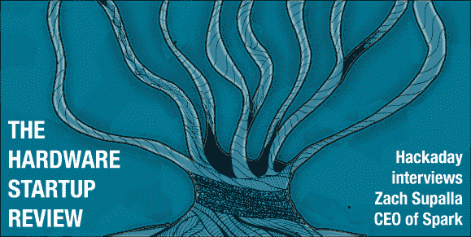
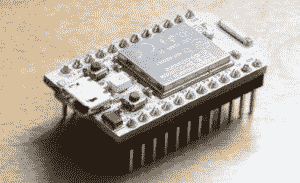

# 硬件启动回顾:Spark

> 原文：<https://hackaday.com/2014/05/12/hardware-startup-review-spark-io/>

不管你喜不喜欢，一股全新的硬件创业浪潮正向我们走来。众筹活动让每个有想法的人都有可能“试水”，精通技术的天使投资人渴望帮助成功的人跨越，而风险资本家则坐在另一边，总是在寻找他们“硬件组合”的潜在补充。正是这些数十亿美元的收购让每个人都加入了这股潮流，而且没有回头路。至少现在是这样。

这一切都很好，我们希望相信这种狂热会带来好的结果。但我们认为，哈卡迪应该参与进来，开始问一些尖锐的问题，而不是袖手旁观。毕竟，这些家伙不认为他们能够逃脱一些制作精美的视频和一些高分辨率的照片，对不对？

对于我们的第一期，我们选择了一个相对无辜的目标——[Spark](http://spark.io)，Spark 核心开发板背后的团队。通过将开源和开放硬件作为其战略的核心部分，Spark 迄今为止一直是枯燥(可能令人毛骨悚然)的物联网“平台”海洋中的一个积极例子。所以我们觉得应该给 Spark 的首席执行官扎克·苏帕拉打个电话。

#### 什么引发了火花

[【扎克·苏帕拉】](https://www.linkedin.com/in/zsupalla)，Spark

首席执行官【扎克】谈到他们最初的项目 [Spark Socket](https://www.kickstarter.com/projects/sparkdevices/spark-upgrade-your-lights-with-wi-fi-and-apps?ref=users) 背后的动机时表示:“我遇到了一个对我来说非常真实的问题，那就是我的父母在沟通，我看到了一种通过连接来解决这个问题的方法。”这个项目名为[Spark Socket](https://www.kickstarter.com/projects/sparkdevices/spark-upgrade-your-lights-with-wi-fi-and-apps?ref=users)，是一款联网照明产品，灵感来自于帮助他的父亲克服与听力损失相关的挑战的需求。他们为该产品在 Kickstarter 上发起了一场活动，但只完成了他们筹资目标的一半。

“我们从市场得到的反馈是，我们的产品不够好”

在反复讨论产品创意并加入深圳的 [HAXLR8R](http://haxlr8r.com/) 孵化器项目(我们[几年前第一次看到这个项目](http://hackaday.com/2012/06/19/bobs-experience-with-haxlr8r/))后，他们最终想到了一个关于 [Spark Core](http://spark.io) 的想法，并运行了[另一个 Kickstarter](https://www.kickstarter.com/projects/sparkdevices/spark-core-wi-fi-for-everything-arduino-compatible) ，这一次得到了令人震惊的回应，产生了 567，968 美元，目标仅为 1 万美元。他们从去年年底开始出货板；我们中的大多数人已经有机会玩了，或者至少希望我们有机会。

#### 硬件选择

我们对选择 CC3000 作为 WiFi 模块感到好奇，[Zach]带着一个理由回来了:

“这可能仍然是对的，但是在我们发布的时候，这是唯一一个您可以非常容易地大量购买的平价 WiFi 模块。例如，当你扩大规模时，还有其他公司生产平价的无线模块——博通和高通就是两个值得注意的例子。他们面临的挑战之一是，很难以低数量获得这些芯片。有意义地说，开源对我们来说很重要”。

至于考虑的其他模块，他说“我们当时评估的主要模块是 RN-171、GainSpan 解决方案和 CC3000。最主要的是价格合理。CC3000 有一些其他产品没有的功能，但是，当涉及到提供经济高效的解决方案时，这是您不可避免地必须做出的权衡。CC3000 加起来达不到 802.11n，它不做 SoftAP 设置，尽管他们有自己的东西:SmartConfig，它很漂亮，但也有它的怪癖”。

在通信方面，Spark 使用的是稍微修改过的 CoAP 版本。“我们不喜欢 [MQTT](http://en.wikipedia.org/wiki/MQ_Telemetry_Transport) 有两点:第一，我们想让它做请求-响应模型，MQTT 是发布-订阅；第二，它没有定义有效负载，我们觉得它没有解决足够多的问题。CoAP 对此做了更多的定义，感觉像是一个更完整的解决方案”。

#### 开放式开发流程

Spark 解决问题的方法似乎相当开放，对黑客也很友好。他们不是试图预先为每件事指定和定义标准，而是采用“学习”的方法。“当我们不确定某件事的答案时，就让它保持开放，看看人们会怎么做，看看社区是否开始陷入一种模式，然后让我们采用这种模式”。

一个很好的例子就是使用 Spark 的设备到设备通信。虽然设备到云的通信似乎被很好地指定了(毕竟，这是主要的用例)，但是设备到设备的通信仍然是相当开放的。在找出解决这个问题的方法时，随着时间的推移，社区似乎已经收敛到一种特定的模式。设备不是通过云进行这种类型的通信(这可能会引入实时应用程序无法接受的延迟)，而是将“云”仅用于认证套接字打开请求。在此之后，所有通信都在本地完成。Spark 团队现在正把它作为设备到设备通信的“官方”设计模式进行推广，并可能最终为它构建协议级支持。

#### 云

Spark 的一个我们特别欣赏的方面是，至少到目前为止，他们的“云”基础设施只专注于一个真正有价值的用例——设备之间的可扩展消息传递。通常这一部分是有很多手势和魔法的地方，但在他们的情况下，这似乎很简单。这是件好事。在接下来的几个月里，他们还将开放 Spark Cloud 的源代码，因此我们也将能够在那时判断内部情况。

更重要的是他们对于谁拥有被推到云端的数据的态度。“物联网‘平台’认为它们真正拥有数据，而作为产品制造商的你是在‘租用’数据。我认为我们的观点更多的是——你制造了产品——这是你的数据。我们来这里是为了帮助你接触到它。因此，我们推出了将您的数据反馈给您的产品。但这不是我们拥有的数据”。

到目前为止，星火小组所说的一切都被证实了。他们正在做所有正确的事情，他们对隐私和数据所有权持健康的态度，他们正在拥抱开放硬件/开放软件，并且他们积极地让社区参与到这个过程中来。但随着他们继续前进，他们将面临更大的盈利压力。因此，其中一些价值观可能会受到挑战。

我们只要盯着他们就行了…

*听下面的完整采访，或者在[硬件启动审查](http://hackaday.io/project/883-The-Hardware-Startup-Review)上阅读[文字记录](http://hackaday.io/project/883/log/2503-interview-with-zach-supalla-ceo-of-spark)。*

[https://w.soundcloud.com/player/?url=https%3A//api.soundcloud.com/tracks/148876907&auto_play=false&hide_related=false&visual=true](https://w.soundcloud.com/player/?url=https%3A//api.soundcloud.com/tracks/148876907&auto_play=false&hide_related=false&visual=true)