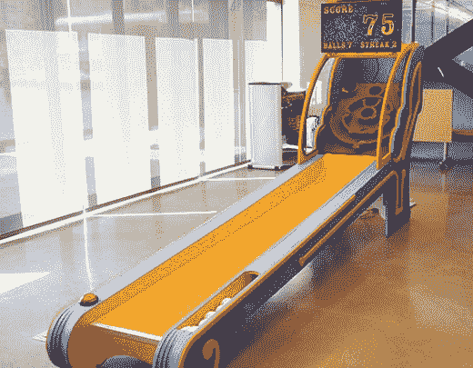

# 有路由器吗？建造一台滑雪球机

> 原文：<https://hackaday.com/2013/10/04/have-a-router-build-a-skeeball-machine/>

世界各地有很多黑客空间和创客实验室，它们拥有惊人的制造能力。铣床、车床、钻床、激光切割机和数控刳刨机对任何制造商的工具库来说都不陌生。你知道什么不是吗？一台 DIY 投球机。

这个“应该是每个黑客空间的项目”项目是 Instructables 上的[真菌 amungus]的创意。尽管你可能认为制造一台双向飞碟机器很复杂，但[真菌]的制造实际上相当简单，而且易于运输。

建筑中使用的主要材料是 7 块 3/4 英寸的胶合板。这些板材是在一台 ShopBot CNC 路由器上切割出来的，并用螺丝固定在一起，形成一个标签槽结构。操场上覆盖着软木，我们认为这是一种合适的滑雪体验，所有的电子设备都由 Arduino 和笔记本电脑控制。

这个建筑的电子设备非常简单——只有几个安装在洞下的红外距离传感器。笔记本电脑正在运行一个处理草图，在笼子上方的电视上显示比分，允许对原始双向飞碟机的游戏性和得分系统进行一些改进。

这是一个非常棒的项目，我们确信无论[真菌]把它带到哪里，它都会成为人们关注的焦点。

[https://www.youtube.com/embed/85qoq5jHGpE?version=3&rel=1&showsearch=0&showinfo=1&iv_load_policy=1&fs=1&hl=en-US&autohide=2&wmode=transparent](https://www.youtube.com/embed/85qoq5jHGpE?version=3&rel=1&showsearch=0&showinfo=1&iv_load_policy=1&fs=1&hl=en-US&autohide=2&wmode=transparent)