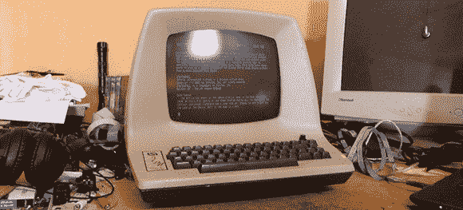

# 享受愚蠢终端的乐趣

> 原文：<https://hackaday.com/2013/03/26/having-fun-with-dumb-terminals/>

很长一段时间以来，[摩根]一直想要一个旧的串行终端。幸运的是，他在 Quelab hackerspace 的一个朋友从一个收藏家那里得到了一个令人敬畏的 ADM-3A 终端。这是计算和 UNIX 历史上具有历史意义的一块，所以显然[Morgan] [需要让它工作起来](http://quelab.net/wordpress/6391/old-tech-adm-3a-serial-terminal/)。

ADM-3A 终端早于著名的 DEC VT-100 终端，但由于[摩根]的新收购物使用 RS-232，他有很好的机会让它与他的一个更现代的盒子一起工作。他正在使用虚拟机中加载了 FreeBSD 的 Windows 笔记本电脑与终端进行对话。令人惊讶的是，唯一需要的额外硬件是 USB 转串行电缆和 DE9-DB25 串行适配器。

它可能没有 Quelab 为 Zork sessions 设置的 [Teletype ASR-35](http://www.flickr.com/photos/killbox/7839549408/in/set-72157626476715713/lightbox/) 那么酷(或响亮)，但很高兴看到古老的硬件有*一些* 的用途。现在，[摩根]正在用 vi 编辑文件，当然也在玩 Zork。看起来这个又老又笨的终端里还有很多生命。在寻找一个旧的 VT-100 有一段时间了，我不得不说我很嫉妒。