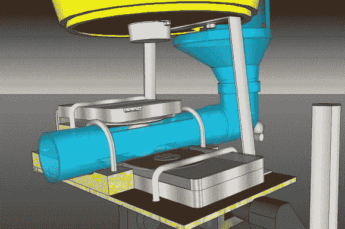

# 硬盘驱动的乒乓球机器人

> 原文：<https://hackaday.com/2013/12/12/hdd-driven-table-tennis-robot/>

需要磨练你的乒乓球技术？没人陪你玩吗？没关系，你总是可以做一个[硬盘驱动的乒乓球发射器！](http://www.miskei.hu/ttrobot/index.html)

【Vendel Miskei】一定喜欢 3D 建模。他在某种 3D CAD 程序中绘制了他的整个项目(纹理看起来有点像 Sketchup？).它利用了两个硬盘，一个电脑电源，一束 PVC 管，一个微波同步电机，和一个顶灯投影仪！

为了让硬盘能够抓住乒乓球，看起来[Vendel]除了一个盘片之外，把所有的盘片都拿走了，然后在上面粘上一些泡沫，看起来像是乒乓球拍上的橡胶。他还利用了原来的硬盘驱动器的情况下，切断了结束暴露半盘。好像还挺有效的！

顶灯投影仪实际上只是作为整个项目的一个方便的加权支架。回收的微波马达索引球在一个桶里，允许大量的球排队！休息后留下来看看该项目的一些令人惊叹的 3D 效果图，以及实际的乒乓球机器人与它的主人玩游戏！

[https://www.youtube.com/embed/goTApke6FzQ?version=3&rel=1&showsearch=0&showinfo=1&iv_load_policy=1&fs=1&hl=en-US&autohide=2&wmode=transparent](https://www.youtube.com/embed/goTApke6FzQ?version=3&rel=1&showsearch=0&showinfo=1&iv_load_policy=1&fs=1&hl=en-US&autohide=2&wmode=transparent)

保罗，谢谢你的提示！]