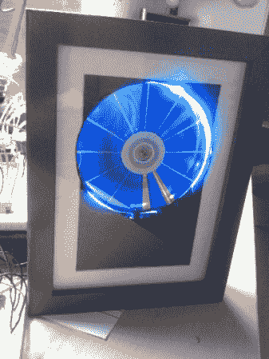

# 硬盘 POV 时钟从之前的产品中汲取精华

> 原文：<https://hackaday.com/2013/01/30/hdd-pov-clock-takes-the-best-from-those-that-came-before-it/>

这种时钟背后的概念以前已经出现过，但[迪特]试图将几个项目的最佳方面结合到他的 HDD POV 时钟中。该设计的基本原理是在硬盘的顶部盘片上切一个槽。这将让一些发光二极管发出的光穿过。通过小心地使 LED 与转盘同步，可以显示一组不同颜色的指针来标记时间。我们已经看了这个项目几分钟了，我们不太确定时钟上标记 5 分钟片段的线条是否与指针以相同的方式产生，或者它们是否是盘片顶部面板上的标记。休息之后，请观看视频，让我们知道您的想法。

以往的硬盘时钟项目包括[这个](http://hackaday.com/2008/10/17/led-pov-hard-drive-clock/)，或者[这个](http://hackaday.com/2009/09/07/hard-drive-rgb-clock/)。一些设计改进包括一个更好的电机驱动器(这是[Dieter]从一台旧的 VCR 上拆下来的)，以及包含一个 RTC 芯片来保持准确的时间，而不需要连接到计算机上。我们还认为将硬件夹在两个相框之间是一种很好的方式，可以获得漂亮的外观。

[https://www.youtube.com/embed/vJ2-xHj5W0U?version=3&rel=1&showsearch=0&showinfo=1&iv_load_policy=1&fs=1&hl=en-US&autohide=2&wmode=transparent](https://www.youtube.com/embed/vJ2-xHj5W0U?version=3&rel=1&showsearch=0&showinfo=1&iv_load_policy=1&fs=1&hl=en-US&autohide=2&wmode=transparent)