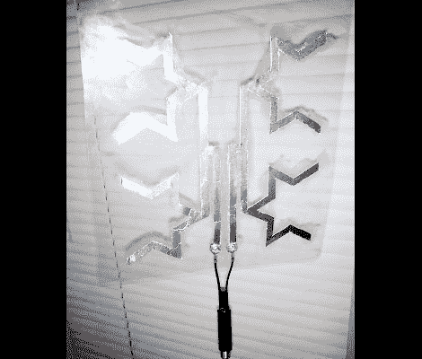

# 可以挂在窗户上的高清电视天线

> 原文：<https://hackaday.com/2012/06/15/hdtv-antenna-that-can-hang-in-a-window/>

我们迫不及待地想试一试。我们有一个自己动手做的 HDTV 天线挂在阁楼上，它是由一些碎木头和八个金属衣架制成的。它很好用，但是很丑，而且不是每个人都有阁楼可以藏它(更不用说屋顶瓦片引起的信号下降)。这是一个固定在透明塑料上的分形天线，所以你可以把它挂在窗户上，然后毫不费力地开始接收空中频道。

图案在 SketchUp 中建模，然后打印在两张纸上。有一张纸的两面都印了字，这样很容易粘在一张铝箔上，然后按照反面的图案剪下重要的部分。另一个模板用作在将箔片粘合到透明塑料上时的对齐指南。然后使用螺母和机器螺钉连接同轴适配器。如果你建造了它，让我们知道它是如何出来的！