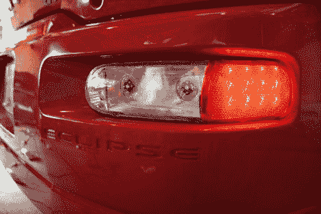

# 他用倒车灯弄瞎了我

> 原文：<https://hackaday.com/2012/04/17/he-blinded-me-with-backup-lights/>

晚上开车时，你需要能看清你要去哪里。这也适用于倒车。但是[Ryan 的]游乐设备上的普通白光灯不能提供他想要的照明类型，所以[他用两组超高亮度的 LED 模块](http://www.hidplanet.com/forums/showthread.php?40209-high-power-led-reverse-lamp-build)代替了它们。这些灯亮得可笑，也许比某些类型的头灯还要亮。由于它们会带来大量热量，安装它们需要大量的工作。

他采购了一些 Cree XM-L T6 LED 模块，汽车两侧各两个。这些可以输出接近 1000 流明的强度。为了让它们保持凉爽，他为每个 CPU 配备了一个散热器。其中包括一个铜芯和铝鳍，像螺旋星爆一样脱落。作为挡板，他使用了一块覆铜板。这给他一个表面来安装散热器，在涂上铬 brite 后，它还可以作为一个反射器。一旦上马，他就发动引擎[差别是显著的](http://www.hidplanet.com/forums/showthread.php?40209-high-power-led-reverse-lamp-build&p=421504&viewfull=1#post421504)。