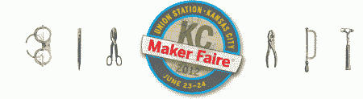

# 前往堪萨斯城马克菲尔

> 原文：<https://hackaday.com/2012/06/22/heading-to-makerfaire-kansas-city/>

今天，我要去堪萨斯的马克尔费尔。我计划广泛报道这一事件。[如果你看到我](http://hackaday.com/2012/06/18/building-a-bug-zapping-lightsaber/)，不要犹豫，走上前来介绍自己。我甚至还为你留了一张定制的乙烯基 hackaday 贴纸。由于我们是黑客，我计划尝试进入细节，并在[【伊恩·莱斯纳特】的带领下](http://www.youtube.com/watch?v=2qkT9hLQPy0&feature=player_embedded)获得采访。我们不只是想看到桌子上一个整洁的东西，我们想知道它是如何工作的，以及那个人遇到了什么障碍。那里见！