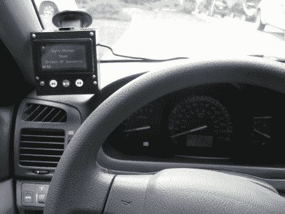

# IPod 的抬头控制

> 原文：<https://hackaday.com/2012/07/24/heads-up-controls-for-your-ipod/>

[cmonaco 3]的女朋友想要一种更好的方式在开车时控制她的 iPod。她不想看路，就问他是否能帮忙。他最终[建造了一个抬头显示器](http://www.instructables.com/id/iPod-Information-Screen)，它可以读出赛道信息，并提供几个简单的控制按钮。

显示屏包括前进、后退和播放/暂停控制。这些按钮和液晶显示屏一起用吸盘安装在挡风玻璃上。这样司机就不必完全把注意力从路上移开来控制坐在乘客座位上的 iPod。

为了实现这一点，[Cmonaco]使用了一个 dock 连接器分线板来实现 Arduino 和 iPod 之间的通信。Arduino 提取歌曲信息以显示在图形 LCD 屏幕上，并在检测到按钮按下时向 iPod 发送命令。休息之后，请观看设置的快速演示。

[https://www.youtube.com/embed/RqbTf2D7ekk?version=3&rel=1&showsearch=0&showinfo=1&iv_load_policy=1&fs=1&hl=en-US&autohide=2&wmode=transparent](https://www.youtube.com/embed/RqbTf2D7ekk?version=3&rel=1&showsearch=0&showinfo=1&iv_load_policy=1&fs=1&hl=en-US&autohide=2&wmode=transparent)

[谢谢克里斯]