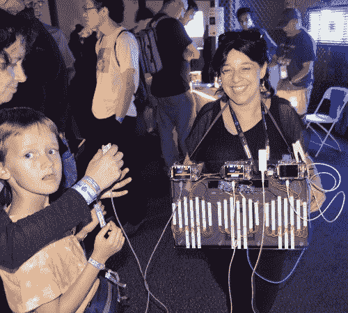

# 心跳音箱创造生物节拍

> 原文：<https://hackaday.com/2013/10/22/heartbeat-boombox-creates-bio-beats/>

如果你碰巧在纽约马克尔展览会期间在科学大厅闲逛，你可能会注意到一个脖子上绑着一个相当奇怪的音箱的女人走来走去。那是索菲·克拉维茨的心跳音箱。幸运的是[Sophi]住在离 Makerfaire 不远的地方，没有试图用她的硬件通过机场安检。她从三台医用级脉搏血氧仪开始。这些血氧仪会在你每次心跳时发出“哔”的一声。[Sophi]推出了她自己的 AVR 板，运行 Arduino 固件，在脉搏到达血氧计音频传感器的过程中捕捉脉搏。AVR 使用声卡将脉冲转换成各种打击声音。脉冲指示器还会激活三个 LED 灯带中的一个。

[Sophi]黑客最大的挫折是为整个系统供电的 LIPO 电池上的 JST 连接器。她发现它们很容易破碎。我们过去使用 JST 连接器没有问题，所以我们猜测她最终使用了许多山寨连接器中的一个。[Sophi]将整个系统与安装在音箱前部的定制研磨丙烯酸板连接在一起。

最后的结果非常圆滑。三个人连接到脉搏血氧仪的手指输入端，可能会形成一些复杂的心跳。当她第一次走过时，我们以为我们在听 dubstep。我们希望看到实现的一个功能是能够录制和回放由 boombox 创建的一些节拍。