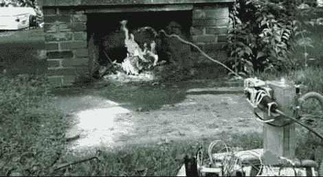

# 寻热火把淹没了火焰

> 原文：<https://hackaday.com/2012/11/10/heat-seeking-firebot-drowns-out-the-flames/>

这个[机器人可以自动发现并扑灭火灾](http://www.willworkforrobots.com/?page_id=71)。这是上个学年嵌入式设计课程项目的高潮。[Dan]和他的同学们开发了一个炮塔，它既有喷嘴又有热传感器，这将是现实生活中塔防游戏的一个奇妙的组成部分。

传感器阵列的瑰宝是 TPA81 热电堆阵列。请注意名称中使用了术语“阵列”。这更像是八个相互对齐的温度传感器。通过监控它们，可以确定热量来自哪个方向。一旦对准了火场，将水送到正确的地方可能是一项艰巨的任务。这就是其他传感器发挥作用的地方。加速度计允许机器人确定喷嘴的角度(在这种情况下使用了杂草喷雾器)。超声波测距仪和一些算法让驱动它的 Arduino 确保水的弧线落在热点上。这在跳转下方的剪辑中显示得非常清楚。

[https://www.youtube.com/embed/1T123YZwocY?version=3&rel=1&showsearch=0&showinfo=1&iv_load_policy=1&fs=1&hl=en-US&autohide=2&wmode=transparent](https://www.youtube.com/embed/1T123YZwocY?version=3&rel=1&showsearch=0&showinfo=1&iv_load_policy=1&fs=1&hl=en-US&autohide=2&wmode=transparent)