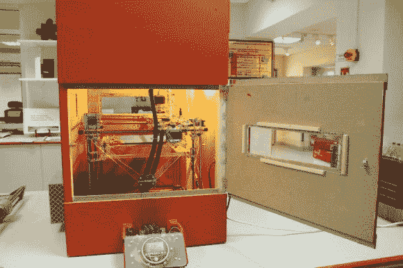
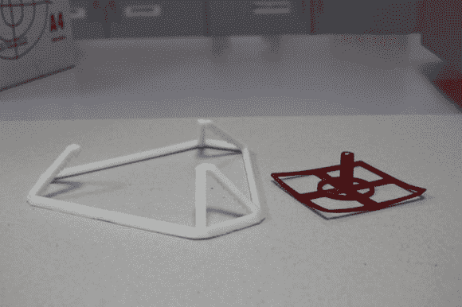

# 加热建造室不必那么复杂

> 原文：<https://hackaday.com/2014/03/19/heated-build-chambers-dont-have-to-be-that-complex/>

希望提高 3D 打印的质量？担心剥离、翘曲和分层？你所需要做的就是做一个[加热建造室！](http://reprap.org/wiki/Heated_Build_Chamber)

加热成型室[是大型 3D 打印机公司拥有的专利](http://hackaday.com/2013/09/11/3d-printering-key-patents/)之一(我们不会指责任何人)，这就是为什么你没有在任何“消费”级 3D 打印机上看到它的特征。但这不会阻止人们自己制作！

[Repkid]刚刚完成了一个关于这个主题的维基页面，这是一个建造加热室的好方法——如果你有空间的话！他用中密度纤维板为他的 RepRap 建了一个大的木制围栏。双层纸板被用作薄的绝缘材料，尽管我们想象如果你在建造这么大的东西，你也可以使用一些商业绝缘材料。

该室由安装在盒子背面的吹风机加热，并且通过改变吹风机的速度设置来控制热量。激光切割透气产品允许进一步调整。如果你想变得非常奇特，安装一个能够更精确地调节温度的恒温 PID 控制器是非常容易的。为了防止电子设备过热，所有的控制板都在盒子外面。

[rep kid]rep rap 没有加热床，但有了加热的构建室，他可以打印 ABS 而不会有任何翘曲——看看吧！

白色的有 HBC，红色的没有。还不错！

你的 3D 打印机有加热成型室吗？如果是这样，我们很想看看！