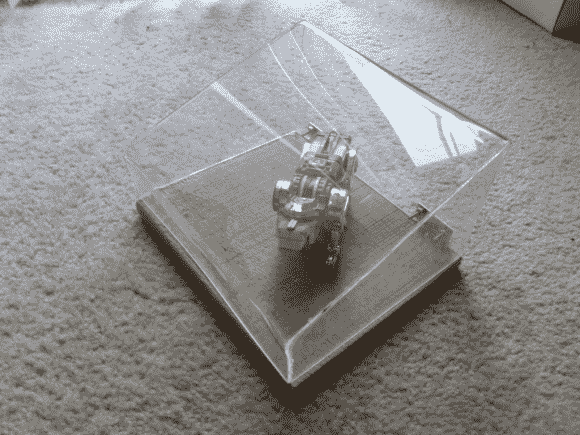

# 加热、弯曲和胶合以制造丙烯酸外壳

> 原文：<https://hackaday.com/2013/02/07/heating-bending-and-gluing-to-make-acrylic-enclosures/>

你可以用亚克力和一些工具做很多事情。如果你刚刚开始，我们建议你看一看[Michael Colombo 的] [加热、弯曲和粘合指南，以创建定制的丙烯酸外壳](http://blog.makezine.com/2013/02/06/workshop-wednesday-heat-bending-acrylic-enclosures/)。你可能已经拥有了你所需要的大部分东西。你可能缺少的一个工具是热风枪。

这个过程从数学开始。在将亚克力切割成一定尺寸之前，你需要计算你需要多少。接下来[Michael]使用 Dremel 和切割轮展示了他的切割技术。我们更喜欢沿着切割线夹紧，用剃刀多次刻划，然后折断材料。但是如果你有合适的锯条，你也可以用台锯把它锯断。

他使用的弯曲技术是从弯曲两边夹住木板开始的。在用热风枪加热弯管时，用废板推压剩下的丙烯酸。一旦所有的角都做成一个整体，侧面就粘在一起了。这最后一步可能很棘手。丙烯酸胶水可以完美缝合，所以要确保你的伤口干净，弯曲的部分对齐。

这一过程被记录在跳跃后发现的片段中。如果你正在寻找一个更有针对性的热源，看看这个专用的丙烯酸弯曲器。

[http://www.youtube.com/watch?v=DIBS93jgiLk](http://www.youtube.com/watch?v=DIBS93jgiLk)