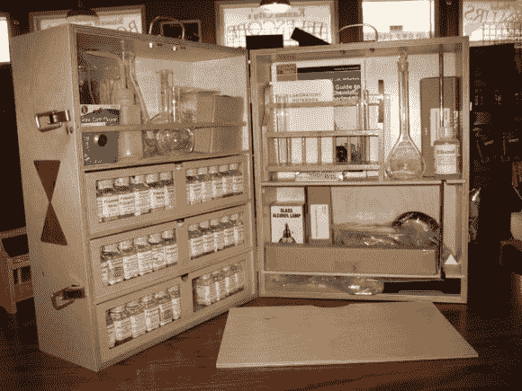

# 传家宝化学套装

> 原文：<https://hackaday.com/2013/11/18/heirloom-chemistry-set/>

我们尽量不分享太多的众筹项目，但当一个线人把我们送到这个[传家宝化学装置](http://www.kickstarter.com/projects/1742632993/heirloom-chemistry-set)时，我们知道一些潜在的化学黑客可能只是想看看它！

[约翰·法雷尔·库恩斯]和他的妻子在堪萨斯州经营着一家名为[h . m . s . Beagle](http://www.hms-beagle.com/)的小型科学商店，年轻的科学家(和成年人！)可以购买专业的实验室用品、设备和资源来研究从化学到物理的所有东西！

这一切都是从 20 世纪 50 年代[约翰]还是个孩子时开始的，他收到了经典的吉尔伯特化学套装作为圣诞礼物，这帮助他走上了成为专业研究化学家的道路。现在，他想和他的孩子们分享他对化学的热爱，他意识到市场上根本没有同类的化学套装！

自从他的商店开业以来，他制作了许多与原版非常相似的定制化学套装，但这些几乎都是一次性的，制作起来非常耗时。所以最近他决定试着做一套他可以大量生产的设备来满足需求，所以他启动了 Kickstarter 来帮助它起步。已经超过目标两倍了！

我们希望长大后能有一个！

【谢谢杰里米！]