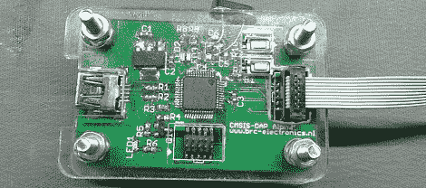

# 帮助创建一个通用的 ARM 程序员

> 原文：<https://hackaday.com/2012/09/17/help-create-a-universal-arm-programmer/>

新一代 ARM Cortex M0/M3/M4 微控制器为开发人员提供了许多有趣的功能。除了通过 USB 支持拖放编程之外，该硬件还可以用作调试器。在代码中的任何一点设置断点和检查内存是一个很好的特性，但是并不是所有我们看到的新的 ARM 开发板都支持这个特性。

SimpleCortex 上的人有解决这个问题的方法，但是他们需要你的帮助。为了让他们的 CMSIS-DAP 硬件与开源工具一起工作，他们正在寻找一些优秀的程序员和硬件开发人员来构建工具链。

目前，该硬件只能与 Keil 开发工具配合使用。封闭的源代码开发环境对任何人都没有好处，所以如果你有编写驱动程序之类的经验，可以给 SimpleCortex 的人发一封电子邮件。他们会给你一个免费的主板，作为对构建开源 ARM 工具链做出贡献的回报。

常识告诉我们，如果你真的打算解决这个问题，你可能只应该给这些人发一封电子邮件。尽管如此，这仍然是一个为开放硬件做贡献的好机会。