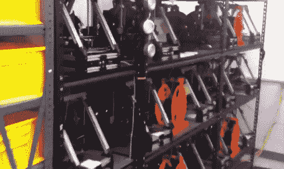

# 帮助我们决定这个巨大的 Reprap 阵列是否是迄今为止最大的舰队

> 原文：<https://hackaday.com/2012/08/23/help-us-decide-if-this-huge-reprap-array-is-the-largest-fleet-to-date/>

花一分钟想想你的理想工作是什么。

想象你是一个可笑的富有的单身汉吗？很好。

回到现实世界中，[Caleb Cover]已经进入了我们在一段时间内见过的最酷的黑客相关工作之一。他最近在 Aleph Objects 公司获得了一份工作，担任一大批 3D 打印机的舰队指挥官。他的职责包括照顾和喂养 30 只迷你马克斯式的 repraps，这是我们当然不介意有的工作描述。

除了对他的新工作幸灾乐祸之外，[Caleb]写道，他问我们是否知道一个比他负责的更大的 reprap 机构。我们想不出一个，但也许你可以。

现在，[Caleb]说他正在研究这些机器生产零件自我复制的能力，这肯定会使它迟早成为最大的生产 3D 打印机的集合。

当你在单调的案头工作中寻找其他大型 reprap 设置时，看看下面的视频，听听每天在门口迎接[Caleb]的 3D 打印交响乐。

你可能见过比这个更大的 3D 打印装置吗？ ~~Pics~~ Vids 还是没发生。说真的，我们想见他们！

http://www.facebook.com/v/4021458368607&# 8243；codebase = "[http://download . macromedia . com/pub/shock wave/cabs/flash/SW flash . cab # version = 6，0，40，0&# 8243](http://download.macromedia.com/pub/shockwave/cabs/flash/swflash.cab#version=6,0,40,0&#8243)；width="470 "