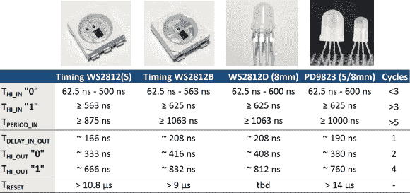

# RGB LED 克隆产品来了

> 原文：<https://hackaday.com/2014/06/25/here-come-the-rgb-led-clones/>

似乎 Hackaday 上每三个项目中就有一个以某种方式使用 WS2812 RGB LEDs。我们都爱我们的闪光灯，明亮、便宜、串行控制的 RGB LEDs 是蜜蜂的膝盖。

就像现在所有的产品一样，相互竞争的制造商发现了这些东西的巨大市场，克隆产品现在已经上市。[Tim]最近[看了一下 PD9823](http://cpldcpu.wordpress.com/2014/06/16/timing-of-ws2812-clones-pd9823/) ，以及 WS2812 的三个版本。[Tim]被认为是 Hackaday 的 WS2812 专家。你可能会从他的 [WS2812 驱动优化](http://hackaday.com/2014/02/02/rewriting-ws2812-driver-libraries-for-optimization/)文章中想起他，这应该是任何 WS2812 黑客的必读之作。

正如我们许多人所知，这些 led 的时序特性很难处理。WS2812S 和 WS2812B 之间的值也不同。[Tim]发现新的通孔 WS2812D 零件又有所不同，尽管与 B 零件非常接近。PD9823 的设计人员一定仔细研究过 WS2812，因为它们的 190ns 时基正好在 WS2812S 的 166ns 时间和 WS2812B 的 208ns 时间之间。PD9823 还需要稍长的复位脉冲。

要点是，像[Tim 的]这样写得好的驱动程序应该对新部件没有问题，但随着更多的克隆产品上市，兼容性是需要记住的。