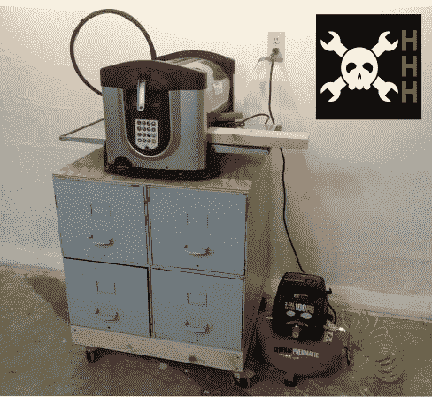

# HHH:来自兔子洞的数控仓储基地

> 原文：<https://hackaday.com/2013/10/18/hhh-cnc-storage-base-from-the-rabbit-hole/>

还记得我们宣布 hack aday Hackerspace henks program 并要求您从您的 hacker space 发送最好的 CNC 黑客吗？到目前为止，这是唯一的条目，这使得[Mazz]成为了将所有战利品据为己有的第一人。如果你想尝试贴纸、衬衫和零件供应商礼品卡，请在 10/31/13 之前提交你的项目。

他送进去的是为他的黑客空间[建造的储物柜底座](http://www.tymkrs.com/rabbithole/)——明尼苏达州罗彻斯特的兔子洞。该小组设法得到了一台 CarveWright 数控机床，但没有多余的工作台来放置它。对他们来说，把大量现金投入某样东西的想法没有吸引力。但幸运的是，大约在这个东西到达太空的同时，一名成员发现路边有一个免费的文件柜。

橱柜是一个垂直的四抽屉单元。它被切成两半，两个抽屉单元并排栓在一起。从这里开始，建造了一个框架来支撑橱柜，并配有锁定脚轮，便于移动。新机器/机柜组合的首次运行是为该空间打造一个标志:

