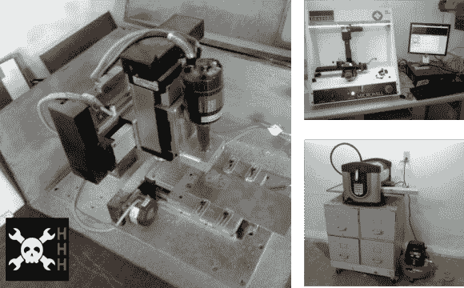

# HHH:数控赢家

> 原文：<https://hackaday.com/2013/11/04/hhh-cnc-winners/>

恭喜第一届 Hackaday Hackerspace 党羽系列的获胜者。我们要求 hackerspace 成员给我们发送关于 CNC 黑客的故事。以下是三位获奖者的综合报道:

来自康涅狄格州 Hackerspace 的[Rich]获得了第一名，他提交了[他们的桌面数控加工厂黑客](http://hackaday.com/2013/10/23/hhh-pcb-mill-from-connecticut-hackerspace/)的故事。他得到一张价值 50 美元的礼品卡，送给他选择的零件供应商。

[Barnaby]也是一个获奖者，他分享了他们如何黑掉一个脚本来将 g 代码翻译成 rlab 的桌面 CNC 工厂接受的专有格式的故事。

[Tim]提交的材料展示了如何在兔子洞为数控雕刻机建造一个可移动的存储基地。

我们希望有更多的参赛作品，并计划给所有人发贴纸，给前五名发衬衫。我们将把衬衫和贴纸寄给三位获胜者。我们还没有决定是否要用新的主题继续 HHH 的节目。我们很想在评论区听到你的想法。