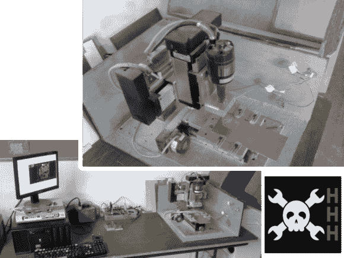

# HHH:康涅狄格州 Hackerspace 的 PCB 工厂

> 原文：<https://hackaday.com/2013/10/23/hhh-pcb-mill-from-connecticut-hackerspace/>

最新的黑客日黑客空间追随者条目来自[Bremster]和康涅狄格州黑客空间。他提到，一段时间以来，他一直想写关于 hackerspace 使用的 PCB/雕刻厂的[，但促使他这样做的是 HHH 项目](http://www.connecticuthackerspace.com/content/4x4-cnc-mini-mill)的[。耶！这正是我们的设想，我们希望有更多的提交将鼓励我们继续和扩大该计划。](http://hackaday.com/2013/10/07/hackaday-hackerspace-henchmen-equals-free-stuff-for-you/)

我们认为这是一个完美的 CNC 项目，适合任何对电子产品感兴趣的黑客空间。它很紧凑，我们发现研磨印刷电路板比化学蚀刻更可取；这个工具应该会很有用。这个特殊的构建使用了 x、y 和 z 轴硬件，这些硬件是从未知的机器上单独拉过来的。像任何优秀的黑客项目一样，制作过程如此令人上瘾，以至于[Bremster]整晚都呆在这个地方，早上 5 点钟就去洗澡和吃饭，然后去上班。

它最初使用 Dremel 旋转工具，但在安装机制中有太多的活动。当他们用上面显示的电机替换它时，他们还加工了一个铝支架，大大稳定了切割钻头。这就产生了干净的多氯联苯，他们甚至用它来制作黑客空间护照的印章。有一个附件，它被铰接在上面两张图片的右边。

查看下面的演示视频，并在 10 月 31 日截止日期前提交您自己的 HHH 项目 CNC 申请。

[https://www.youtube.com/embed/Cbn0AtbUHt4?version=3&rel=1&showsearch=0&showinfo=1&iv_load_policy=1&fs=1&hl=en-US&autohide=2&wmode=transparent](https://www.youtube.com/embed/Cbn0AtbUHt4?version=3&rel=1&showsearch=0&showinfo=1&iv_load_policy=1&fs=1&hl=en-US&autohide=2&wmode=transparent)