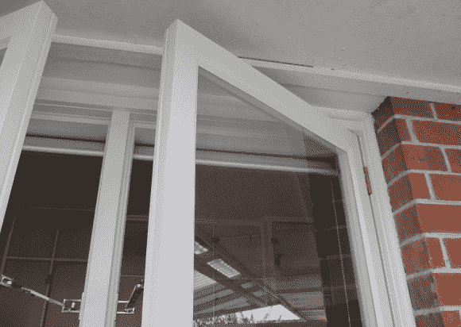

# DIY 家庭安全隐藏簧片开关

> 原文：<https://hackaday.com/2013/12/11/hidden-reed-switches-for-diy-home-security/>

[里斯]想保护他的家免受窃贼的侵害，但不想走使用那些笨重的塑料磁铁和簧片开关交易的正常路线。所以他采购了一些玻璃簧片开关，自己制作了一个完全隐藏的安全系统。

通过使用小的玻璃簧片开关，里斯能够将它们平齐地安装在窗框上方的木板上。为了做到这一点，他钻了两个槽，然后凿了两个槽，让簧片开关进去，电线进入房子。一点 bondo 或干墙填料和一些油漆后，他们完全看不见！最后，他把小钕磁铁粘在窗框的顶部，用来关闭开关。这是一个非常干净的建筑，而且非常便宜——像这样给整个房子布线的可能性非常诱人！

他已经安装了开关…为什么不把它们都连接到一个完整的家庭安全系统上呢？我们去年分享了一个项目[就是这么做的！](http://hackaday.com/2012/08/02/home-security-anyone-can-build-and-install/)