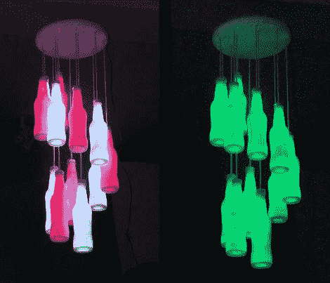

# 潮人吊灯

> 原文：<https://hackaday.com/2012/05/28/hipster-chandelier/>

这个枝形吊灯是我们希望在当地画廊商店看到的东西。几年前做的，我们很喜欢它的外观。材料都挺普通的，一个下午就能扔在一起。

扩散器由透明玻璃汽水瓶制成。在移除标签并给它们一个好的清洁后，它们每个都被颠倒放置并喷上一些玻璃磨砂喷雾。一根四芯电话线既可以支撑瓶子，也可以为每个瓶子内部的 RGB LED 提供电路。瓶子的原始螺旋盖使得焊接完成后安装它们变得很困难。有两种常见的颜色总线，以便可以同时显示交替的颜色。看过视频后，我们认为你会同意布线方案有助于一些伟大的动画效果。

[https://www.youtube.com/embed/qmPJBrVtgsQ?version=3&rel=1&showsearch=0&showinfo=1&iv_load_policy=1&fs=1&hl=en-US&autohide=2&wmode=transparent](https://www.youtube.com/embed/qmPJBrVtgsQ?version=3&rel=1&showsearch=0&showinfo=1&iv_load_policy=1&fs=1&hl=en-US&autohide=2&wmode=transparent)

[谢谢克雷格]