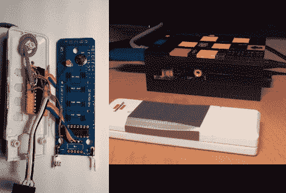

# 带遥控墙上插头和树莓派的家庭自动化

> 原文：<https://hackaday.com/2012/06/05/home-automation-with-rc-wall-plugs-and-raspberry-pi/>

[杰克]找到了一些便宜的硬件，并想出了一个方法来使用它作为一个巨大的家庭自动化网络。他选择了一个 Raspberry Pi 板将无线电控制的电源插座连接到他的网络。他把他的项目分为两部分，第一部分是[黑掉 RC 插座控制器](http://www.jakebyrne.com/adding-web-connectivity-via-usb-to-remote-controlled-sockets-part-1-hardware/)，第二部分是[用树莓派操控它](http://www.jakebyrne.com/adding-web-connectivity-via-usb-to-remote-controlled-sockets-part-2-software/)。

这些 RC 插座是连接到电源的电器(灯、消费电子产品、圣诞树等)的通道。通常廉价遥控器使用的协议很难操作，但是[杰克]真的在这一个上完成了它。除了模拟遥控器上多达 15 个设备的按钮按压，他还更换了 DIP 开关包。这让他可以改变编码，基本上允许一个设备控制多达 32 组插座。理论上，这让他可以从 Raspberry Pi 控制 480 台设备。由于该板是一个网络服务器，因此只需编写一个接口即可。

这个黑客的一些灵感来自于口哨控制的电器黑客。