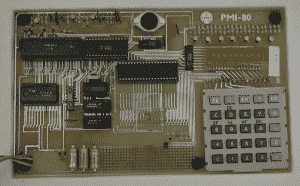
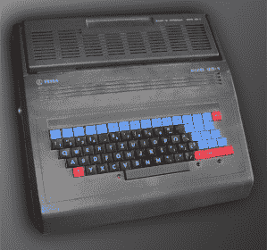
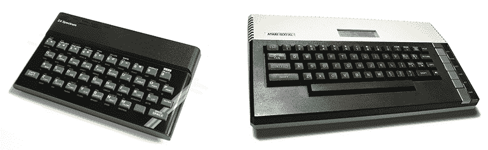
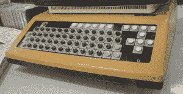
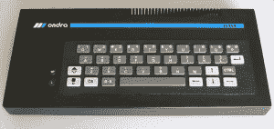
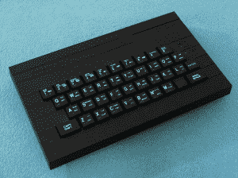

# 铁幕后的家用电脑

> 原文：<https://hackaday.com/2014/12/15/home-computers-behind-the-iron-curtain/>

我于 1973 年出生在捷克斯洛伐克。那是欧洲中部的一个小国，不幸处在铁幕的黑暗面。我们从来就不是苏联的一部分(正如许多人认为的那样)，但我们是所谓的“苏联卫星”，与波兰、匈牙利和东德肩并肩。

我的爱好是电子和——在 80 年代中期——计算机。铁幕背后的计算机历史非常有趣，有很多不寻常的时刻。例如——共产主义者起初称控制论为“资产阶级的‘伪科学’(以及社会学或符号学)，“用来用机器奴役一个人类”。但是后来他们明白了计算机的重要性，主要是对科学和军事的重要性。因此，在 50 年代，东方集团开始建造自己的计算机，单独地，“以自己的方式”。"

最大的问题是缺乏现代技术。东方国家有许多有技能和聪明的人，但是他们在基本的技术方面有很多问题。电子零件的生产被分散到不同的国家，即经济互助委员会。现实中导致了一个很荒谬的情况:你可以买到 Z80 的东部仿品(东德制造为 [U880D](http://en.wikipedia.org/wiki/U880) )，但你不能同时买到 74LS00。是的，很多制造商生产了这种产品，但是“现在缺货；试问明年”。所以“制造一台电脑”意味着 50%的电子技能和 50%的非官方社交网络和知识，比如“我认识一个人，他认识一个人，他的邻居在一家工厂工作，那里可能有多氯联苯的材料”。

我们可以谈论很多关于捷克斯洛伐克的计算机，例如 [SAPO 计算机](http://en.wikipedia.org/wiki/SAPO_%28computer%29) (7000 个继电器和 400 个真空管，1958)或 Epos 2 (1968，二极管和晶体管)。后来，Comecon 决定制造西方计算机的克隆产品——更好的说法是“未经许可的盗版”——即 IBM-360 或 DEC PDP-11。1974 年，Comecon 提出了另一项战略:建立小型计算机生产线。

举个例子:在那个时候[CoCom 禁运](http://en.wikipedia.org/wiki/CoCom)拒绝向苏联集团出口现代技术，例如现代 CPU(例如 68000)。但是东方制造商基于逆向工程、间谍和数据表制造了他们自己的复制品。捷克斯洛伐克 IC 制造商 Tesla 制造了 8080 克隆 MHB8080 和 Intel 3000 的副本，德国供应商制造了 8008 和 Z80 克隆(U808D 和 U880D)，苏联制造了 8080 和 8086 克隆，保加利亚工厂制造了例如软盘机械等。

我必须向所有其他后 Comecon 国家道歉。他们有自己的家庭电脑场景，但我不知道他们的电脑等细节。但是我们可以说铁幕后面的每个国家都在 80 年代制造了自己的家用电脑，一半是“自己的设计”，一半是“西方电脑的克隆”。例如，保加利亚人有与苹果 II 兼容的“Pravetz”电脑(但有一种与 Oric-1 兼容)。

在捷克斯洛伐克，有一家名叫特斯拉的大型电子工厂。它的名字应该是“Technika Slaboprouda”(英文“低压技术”)的缩写，但我猜它显然指的是【尼古拉特斯拉】。它是由各种电子相关的工厂组成的。一家特斯拉生产半导体，另一家生产电视，还有一家生产电唱机底盘。这是“完全合作”世界中的一点竞争(我记得他们在基础学校教我们“竞争是不好的”，因为“工人应该合作发展社会主义，既不竞争也不竞争”)。

捷克斯洛伐克的计算机天才之一[Eduard smutn]和他的孪生兄弟[Tomá]一起设计了基于以色列 ELBIT 的工业计算机 JPR-12，并在特斯拉投入生产。几年后，他们在 8080 的基础上制造了 JPR-1，简单的 8 位计算机。关于这台计算机的一个重要时刻是，这些设计师在捷克斯洛伐克爱好杂志“Amatérské Rádio”上发表了完整的原理图和 PCB。这很奇怪——你在商店里买不到像 led 这样的部件，但这里有一个非常强烈的爱好者的场景。这些人制造了无线电发射机、家庭自动化或高保真放大器。共产党政权出人意料地支持他们(或者更好地说:不要压制他们)的活动，因为它觉得经济需要技术熟练的人。

JPR-1 是一台单板计算机，板上装有 8080 及其支持芯片(8224 和 8228)和一些存储器。还设计了其他板卡，例如字母数字电视显示器、端口板、存储板、薄膜键盘、串行端口等。泰斯拉制造了一系列这样的电路板作为工业计算机，命名为 SAPI。[smutn]还制作了一个基于 Z80 的等效 JPR-1Z，因为(如他所说)JPR-1 可以作为 CP/M 机器工作，但 Turbo Pascal 需要 Z80 指令。

Tesla Ondra.

他的最后一台电脑是“翁德拉”(1986)——基于 Z80 的简单电脑，64kB 内存，在单板上构建，键盘嵌入在单个机箱中。作者说，它的灵感来自 Sinclair 的 ZX-81，但他不能依赖 ULA 或类似的定制 VLSI，所以他设计了所有这些功能，如 RAM 刷新或显示定时，作为非常聪明的硬件黑客，基于 8253 定时器/计数器和其他部件，可在 Comecon 买到。特斯拉只生产了大约 1000 台这种电脑，其中大部分用于青年电子俱乐部。

PMI-80

其他特斯拉电脑是由斯洛伐克工程师 Roman Ki 设计的。第一台是 PMI-80，是一台典型的单板计算机，例如众所周知的 KIM-1。PMI-80 具有 8080 等效 MHB8080、1 kB RAM、8255 PIO(可以添加第二个 PIO 并扩展端口线路)、计算器键盘(5×5 矩阵)和计算器 LED 显示屏(9 个位置)。它的监视器占用 1kB 的 ROM。用户可以连接一些硬件来控制和存储盒式磁带上的程序(全部由软件控制，没有专门的 IC)。PMI-80 被广泛用作学校计算机或简单的工业计算机。

第二台计算机是由[木村]设计的，是 PMD 85。“85”不是指英特尔 8085。Ki 说他的灵感来自惠普公司的 HP-85 电脑。PMD 85 有 32kB 的用户内存，16kB 的视频内存，4kB 的监控只读存储器，它是基于 8080A 的。PMD 85 带有带有内置基本 G. G 的 EPROM 模块，用于图形——PMD 85 是第一台捷克斯洛伐克 8 位计算机，具有精细图形模式 288 x 256 像素(黑白)。

PMD 85-1

PMD-85 变得相当受欢迎。它有他的缺点；一些 IO 的插座不精确，一些 IO 有时会过热。另一方面，它确实是当时最好的捷克斯洛伐克计算机。特斯拉做了一些继任者，命名为 PMD 85-2，PMD 85-2A 和 PMD 85-3，更好的键盘，更多的内存，彩色显示器或全 RAM 模式。捷克球迷为 PMD 制作了许多游戏和实用程序，以及硬件附件，从工业打印机接口到操纵杆接口。直到今天，PMD 在捷克和斯洛伐克共和国仍然拥有强大的社区，你可以购买或构建软盘驱动器或 MIF-85——一种基于 SAA1099 的声音接口。

PMD 有一些克隆产品，即 Maťo、zbrojováek 或 Didaktik Alfa，不是由特斯拉制造的，而是由合作社、学校供应商或军火制造商 Zbrojovka Brno 制造的。

如果说 PMD-85 是最受喜爱的电脑，那么它的表亲 IQ-151 则是最受憎恨的电脑。它是由捷克公司 ZPA 设计的，该公司是一家专注于工业自动化的研究工厂。IQ-151 是一台又大又重的计算机。它包含“主板”与 8080 CPU 和一些支持部件，扩展模块的码头和臭名昭著的过热电源，但它不能为两个以上的模块提供足够的电力。如果你想工作，你必须连接至少一个显示模块和一个基本模块。这真是一台可怕的电脑。糟糕的设计，糟糕的制造，糟糕的键盘看起来像是基于门铃。制造商后来做了一些必要的改变，但用户不喜欢 IQ-151。

IQ-151 被计划作为一台学校计算机，一些学校实际上得到了它。在东方集团的黎明，IQ-151 被升级为在局域网中工作，带有某种 CP/M。布拉格查尔斯大学的数学和物理系开发了他们自己的操作系统 AMOS 和 Pascal 编译器。

我来说一点关于“家用电脑”的评论。翁德拉或 PMD-85 是我们现在所理解的家用电脑:带键盘的单个机箱，作为存储设备的盒式磁带和用于视频输出的电视。但是“家”和捷克斯洛伐克的计算机联系在一起会产生强烈的误导。这些电脑的价格实在是太棒了——相当于六个月的平均工资，所以大部分产品都被学校、俱乐部、工厂或研究所买走了。从技术上讲，有家用电脑，但几乎没有人真正在家里拥有这些电脑作为自己的个人电脑。

所以问题是:我们家里真正的家用电脑是什么？简单的回答是:我们可以从西德、奥地利或英国走私的所有东西。最受欢迎的品牌是辛克莱和雅达利。当然，你可以非正式地购买辛克莱 ZX 频谱和雅达利 800 XL，价格大约是一个月的工资。有时一些官方进口商发疯了，购买 1000 件夏普 MZ-821 并在当地市场上出售。Sord m5 的情况也是如此——捷克斯洛伐克大约有 1000 支 m5。在 80 年代末，一些 Amigas 或 Atari STs 出现在捷克斯洛伐克，但再次单独进口。

但是这些进口商没有一个进口过任何文献、手册，只是任何东西，所以捷克斯洛伐克的电脑迷是“有理由的黑客”。信息的完全缺乏使我们几乎到处都能找到知识的碎片。在业余爱好杂志，外国目录，书籍，外国杂志的糟糕影印。例如，我的朋友只有一台 Atari 800XL，6502 和反汇编软件的指令名称列表，所以他通过试错法重建了整个指令代码表和代码的含义。我在打字机上把他的评论和“发现”改写成三份样本，寄给了俱乐部时事通讯。

不用说，不仅有官方的电子和无线电杂志《Amatérské Rádio 》,而且一些电脑俱乐部也发行自己的杂志。它们以不同的质量水平出版，从用回形针连接的四份文件到专业的小册子，一系列发行几十或几百份。这些俱乐部的成员免费分享他们的知识，借出文件和复制软件，从一盒磁带到另一盒磁带。是的，它侵犯了版权，而且无处不在——从业余爱好者到大公司。

The ZX Spectrum and Atari 800XL

有两个强有力的场景:一个在 Sinclair/Spectrum 周围，一个在 Atari 周围，两者都有成千上万的所有者。有些人有 C64 准将，有些是 Sord，Sharp MZ 或 Amstrad CPC，每种型号都有几十或几百个用户。但是也有罕见的电脑。例如，我朋友的父亲出差“到西方”买了一台激光 210，这是罕见的电脑在这里。它很贵，所以他没有买任何软件或其他东西。我的朋友当时有一台电脑，几乎没有任何软件或知识，他只有一本用户手册，他找不到任何拥有同一台电脑的人来分享信息或软件。

谈到软件——情况更加荒谬！试着猜一猜——1987 年，你能在捷克斯洛伐克的软件商店里买到多少种家用电脑软件？不，不是 1000。连 500 都不到。既不是 100 也不是 50…不，不是 10。正确答案是:你在商店里买不到软件！没有卖软件或电脑游戏的商店。它是从西方国家走私和抄袭来的。另一方面，软件的缺乏意味着几乎每个电脑用户都必须学习一点编程，至少是 BASIC 语言。有许多熟练的程序员编写游戏、编译器和数据库程序。另一个好奇:你写了一个软件的时候，卖它是违法的！这在 1988 年才变得合法，你仍然需要得到一份授权协议。

为了回答“为什么捷克斯洛伐克的家用电脑主要使用盒式磁带而不是软盘？”因为你不能简单地在当地商店买到软盘。全国有五到十家设备较好的商店，他们可能有软盘。例如，他们得到了 10 盒 5.25 英寸软盘，在一个小时内销售一空，两个月、三个月、六个月都卖不完……唯一的解决办法是走私或黑市。80 年代末略有好转。

Didaktik Gama

1987 年，学校用品制造商 Didaktik Skalica，PMD 克隆 Didaktik Alfa 的制造商，制造了另一台名为 [Didaktik Gama](http://en.wikipedia.org/wiki/Didaktik#Didaktik_Gama) 的计算机，这是 ZX Spectrum 的真正克隆，扩展了 8255 PIO，RAM 扩展到 80 kB。他们在某处购买了大量原始 ula，因此他们构建了 ZX 频谱克隆，并开始以合理的价格出售。在 80 年代末，我们可以用一个月的工资在家里买一台捷克斯洛伐克的电脑。

这是捷克斯洛伐克个人电脑的官方部分。不得不提两个局部现象。第一个是“资本主义飞地”——JZD sluovice(JZD 的意思是“农业合作社”)。它的领导人建立了一个有许多经济例外的市场绿洲，因此他们可以直接用外币、美元或德国马克购买集成电路。因此，他们用现代设计制造了非常复杂的计算机，例如基于 Z80，带有两个软盘驱动器、RAM 磁盘和 CP/M。哦，对不起，不是 CP/M，是 MIKROS 或 TNS-DOS——它与 CP/M 完全兼容，但没有许可证。在 80 年代末，他们计划与 PC 兼容的 16 位计算机，但后来东欧集团崩溃了，我们可以直接购买原始的 PC，主要是在奥地利或德国等邻国销售。

这个时代的第二个现象是业余爱好电脑。如前所述，Amatérské Rádio 出版了大量来自捷克斯洛伐克爱好者的不同单板计算机的原理图和 PCB。这些计算机只有一个或很少的样本。Amatérské Rádio 自己发布了自己的模块化计算机系统 Mikro-AR。但我能记得的最怪异的设计是 Mistrum 计算机——它与 ZX 频谱兼容，但 ULA 是由一堆来自 74LSxx 线的芯片模拟的。这是一件令人难以置信的作品，是一个时代的纪念碑，在这个时代，人们可以开发计算机，但不能像“购买组件和构建”那样简单，真正的黑客时代不是为了好玩，而是必要的。

当东方集团垮台时，我们迅速填补了技术空白，并开始使用当代硬件，购买软件(嗯…慢慢地)并适应标准的计算机经济学(我在 1992 年春天的第一份工作中使用 AT286 和激光打印机)。但是你知道，我们有时会回忆起我们的第一台电脑…

* * *

铁幕后的捷克斯洛伐克“家用电脑”——或者更好地说是“你在 80 年代可能遇到的官方制造的 8 位电脑”:

#### JPR 一号(SAPI 一号):

多板计算机，基于 8080A，1kB RAM，高达 8kB EPROM。其他板增加了 RAM、EPROM、20 行 x 40 字符的电视显示器、QWERTY 薄膜键盘等。内置 MIKRO BASIC 和 monitor。它的主要目标是工业。

#### PMI-80:

单板学校 CPU 8080A，1.1111MHz (10MHz / 9)，1kB RAM，1kB ROM，25 键计算器式键盘，9 位 7 段 LED 显示屏。内置监视器。磁带输入输出。作为技术学校的教学工具。

#### PMD 85 比 1

CPU 8080A，2.048MHz，48kB RAM(后期型号 56kB 或 64kB)，4 kB ROM(后期型号 8kB)。标准 QWERTY 键盘，电视输出 288×256 单色图形，25 行，48 字符。最后一个型号可以使用 8 种颜色，第一个型号只有 4 种:黑色、白色、灰色和闪烁)。磁带卡座作为存储。1 位蜂鸣器。两个并行端口，串行端口(8251)。它使用带有 BASIC 语言的 ROM 卡盒(以后你也可以买 Pascal)。

#### 智商-151:

学校电脑，基于 CPU 8080A，2MHz，32kB RAM(最高 64)，6kB EPROM (+墨盒)，32 行 x 32 字符 TV OUT(后来每行 64 字符)，可以添加 512×256 像素分辨率的图形单色模块。单比特扬声器。5 个扩展槽，其中两个被显示适配器和 BASIC 永久占用。电源很差，容易过热。

#### 特斯拉翁德拉:

非常罕见的电脑。CPU U880D (Z80 克隆自 GDR)，2MHz，64kB RAM，4kB ROM，电视显示器 20 行 x 40 字符，图形模式 320 x 240 单色。QWERTY 键盘，磁带接口。BASIC 在磁带上，你必须在使用前加载它。

#### 迪达提克·伽马:

 ZX 频谱克隆了原始的 ULA1 年代早期的较新型号 Didaktik M 和 Didaktik Kompakt 使用苏联的 ULA1，因此显示器是方形而不是矩形，并且存在一些时间不兼容)。这是你能买到的第一台真正的家用电脑。

* * *

## 关于作者

 【马丁·马尔】为捷克一些报纸担任媒体技术顾问和开发团队负责人。他有创业的经验，做过很多网络项目(例如，他是捷克博客系统 Bloguje.cz 的首席开发人员、程序员、管理员、经理和思想家)。

除了编程，他最大的爱好是微电子和旧电脑。他在基于微控制器(8051 系列、AVR、微芯片)和一些“自制”小工具、计算机等的铁路引擎上做了一些任务编程。他在[ASM80.com](http://hackaday.com/2014/11/15/multi-target-ide-for-8-bit-cpus/)将他的两个爱好结合在一起——一个 8 位 CPU 的在线 IDE 和汇编程序。

[Martin]是新 Web 技术(OpenID、OAuth、云计算、HTML5、Node.js、Coffeescript 和其他东西)的倡导者和教师，也是移动设备 HTML5 开发的倡导者。

他写了很多东西——从一些青少年的文本实验开始，通过一系列博客和在线杂志继续，他最终成为了关于网络技术的在线杂志 zdrojak.cz 的主编。