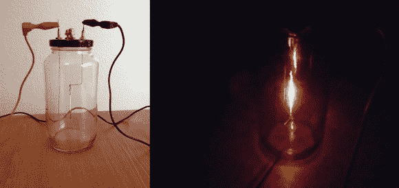

# 自制灯泡是一个有趣的概念证明

> 原文：<https://hackaday.com/2014/07/11/home-made-lightbulb-is-a-fun-proof-of-concept/>

你有没有看过一些最经典和改变世界的发明，然后想，“该死，如果我出生在 100 年前，我完全可以发明出来！”。有时候尝试利用精确的材料重现这些发明会很有趣——就像这个[基于罐子的碳丝灯泡！](http://www.instructables.com/id/Homemade-Lightbulb/step5/The-Hangers-Cont/)

这个项目是由你可能已经拥有的简单家居材料制成的。一个罐子，一些铅笔芯，一个衣架，一些螺母和螺栓，一点硅胶，钢琴丝和一点 JB 焊。你唯一没有的东西可能是一些压缩的二氧化碳——除非你有厨房灭火器、彩弹枪或那些自制的碳酸化机……或者你可以买一些干冰，让它在密封灯泡之前在瓶子里升华。

不需要任何花哨的工具(除了一个填充灯泡的空气喷嘴)，而且建造起来也不太困难。最棘手的部分可能是钻小孔穿过螺丝，但如果你选择好的黄铜螺丝，这将是很容易做到的。

一旦组装好了，就把它插到汽车电池上，享受你低效的 1 流明灯泡吧！尽管如此——相当有趣的实验！