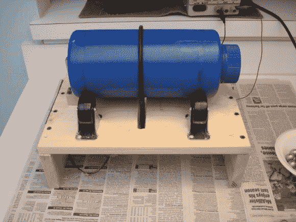

# 自制球磨机像冠军一样翻滚前进

> 原文：<https://hackaday.com/2014/03/18/homemade-ball-mill-tumbles-along-like-a-champ/>

 【迈克】喜欢用玻璃做各种事情。他喜欢把它熔化，融合成新的东西，所以他想自己做玻璃是完全可以理解的。这样做需要精细研磨的化学品，所以[迈克]组装了[这个令人敬畏的自制球磨机](http://www.mdpub.com/ballmill/index.html)。

这个设计非常简单。研磨机由一台打印机的 12v 直流电机驱动，他通过可变电源运行，以微调速度。[Mike]搭建了一个废木头平台，并安装了四个脚轮，让鼓可以靠着它旋转。鼓是由一个圆带旋转的，这个圆带是他在其他项目中找到的。[Mike]我已经有了几个蓝色的容器，以前是用来装振动滚筒刷中使用的磨料的。

[Mike]在滚筒离开脚轮时遇到了一些问题，所以他用废铝片做了一个终点挡板。为了这个项目，他只需要购买 5/8”钢球和脚轮。磨也可以用作一个摇滚不倒翁，虽然瓶子并不完全防水。他不推荐使用这种装置来研磨火药或其他爆炸物，我们也不推荐。

跳起来看看工厂的运作，进行一次盛大的旅行。如果你需要更多的翻滚动力，[使用烘干机马达](http://hackaday.com/2014/01/14/refurbishing-a-vibratory-tumbler-with-a-dryer-motor/)！

[https://www.youtube.com/embed/qDJPgNBEIv8?version=3&rel=1&showsearch=0&showinfo=1&iv_load_policy=1&fs=1&hl=en-US&autohide=2&wmode=transparent](https://www.youtube.com/embed/qDJPgNBEIv8?version=3&rel=1&showsearch=0&showinfo=1&iv_load_policy=1&fs=1&hl=en-US&autohide=2&wmode=transparent)