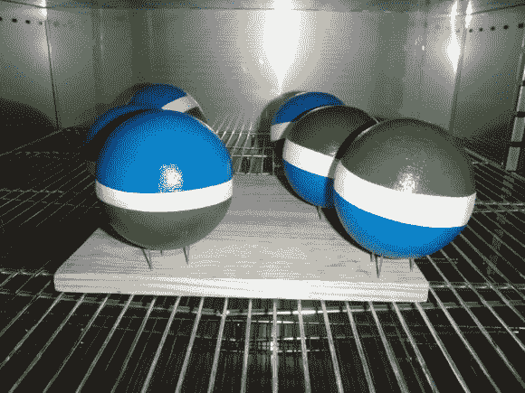

# 自制地滚球

> 原文：<https://hackaday.com/2013/03/29/homemade-bocce-balls/>

对于那些不熟悉地滚球的人来说，地滚球是一种户外运动，用一组柚子大小的重球来玩。我们从来没有真正想过自己做一套，但正如你在上面看到的，这是可以做到的。这些是[六个由【Horvitz444】在国内](http://imgur.com/a/JawPa)生产的地滚球。

似乎市场上可以买到的球有一层高冲击环氧树脂覆盖的水泥或粘土核心。[Horvitz444]能够从一些真空成型开始重现这一点。他用钉板和一个商店吸尘器建造了他自己的模型。他使用的塑料原料是一个来自家庭商店的光板。在烤箱中加热后，他用看起来像两个半地滚球的东西做了一个模具。使用烙铁将两半模具熔化在一起。在倒入水泥成分的秘密混合物并让它们硬化后，他从模具中取出球体，并将接缝打磨光滑。它们被环氧树脂覆盖并涂上油漆。这些细节大多是从他在 Reddit 帖子中的评论中收集的。