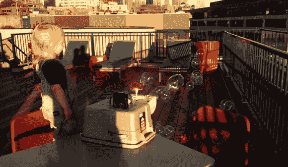

# 给孩子们的自制泡泡机器人

> 原文：<https://hackaday.com/2014/08/13/homemade-bubble-robot-for-the-children/>

孩子们通常很容易被逗乐，但是当刺耳的琴键不再引起他们的兴趣时，你可能想看看[drenehtstral]的新项目。他创造了一个[自动泡泡机器人](https://www.youtube.com/watch?v=qI63kaSsP8g) (YouTube 链接)，让孩子们无休止地娱乐！

该项目始于一个节日，当时[drenehtsral]的一个孩子对泡泡机产生了浓厚的兴趣。以前从未听说过泡泡机，但事实证明它在实践中非常简单。所有需要的是一箱肥皂水，一个转动泡泡棒的马达，一个形成泡泡并让它们在空气中轻轻飘散的风扇。

[drenehtstral]还使用了 12V 电池供电，一些其他硬件来保持这一切，以及 5V 调节器和一些其他控制风扇和电机的电子设备。他指出，他本可以买一台泡泡机，但以真正的黑客风格，他觉得自己动手制作很有趣。这个项目的下一步可能是[改变泡泡大小的东西](http://hackaday.com/2011/07/10/bubble-blowing-bot-blows-big-bouncy-bubbles/)，或者可能是机器人的一组轮子，这样它就可以在移动中娱乐孩子们了！

[https://www.youtube.com/embed/qI63kaSsP8g?version=3&rel=1&showsearch=0&showinfo=1&iv_load_policy=1&fs=1&hl=en-US&autohide=2&wmode=transparent](https://www.youtube.com/embed/qI63kaSsP8g?version=3&rel=1&showsearch=0&showinfo=1&iv_load_policy=1&fs=1&hl=en-US&autohide=2&wmode=transparent)