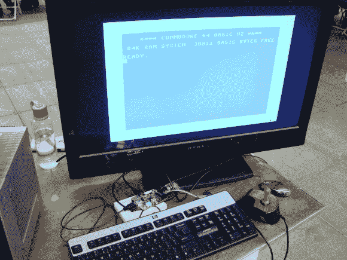

# 希望 X:准将 64 回来了，宝贝

> 原文：<https://hackaday.com/2014/07/19/hope-x-commodore-64s-are-back-baby/>

也许他们并没有真的离开，但即使如此，Commodore 爱好者[【ALWYZ】](http://1200baud.wordpress.com/)在 HOPE X 传播对 Commodore 64 的重新认识，并且仍然有 Commodore 粉丝社区在那里进行一些非常酷的项目。

其中一个项目是名为 [Q-Link Reloaded](http://orrtech.us/qlink/index.html) 的量子链接式服务。Quantum Link 是 Commodore 64 和 128 用户可以使用的在线服务，提供电子邮件、在线聊天、文件共享、在线新闻和即时消息。它从 80 年代中期持续到 90 年代中期，后来演变成美国在线。2005 年，一群人对原始服务器代码进行了逆向工程，由此产生的 Q-Link Reloaded 让 Commodore 的人们又一次可以相互交流了。

还展示了一个运行 [C64 仿真器](http://www.commodorepi.co.nr/)的 Raspberry Pi，配有一个控制器到 GPIO 适配器。就在几个月前，Hackaday】报道了这个模拟器，很高兴亲自看到它工作。

