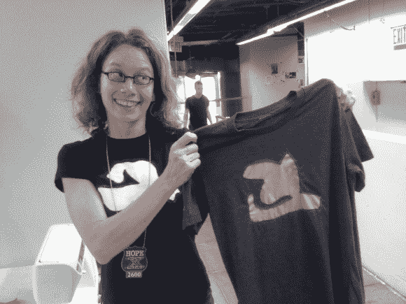
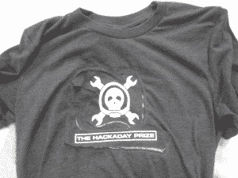
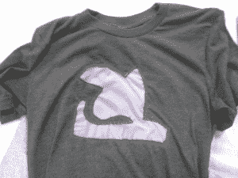

# 希望 X: Hackaday 衬衫在黑客大会上被黑

> 原文：<https://hackaday.com/2014/07/19/hope-x-hackaday-shirt-gets-hacked-at-hacker-convention/>

在我的[上一篇帖子](http://hackaday.com/2014/07/18/hope-x-lock-picking-and-lock-sport/)中，我提到我们在 HOPE X 这里遇到了很多有趣的人。其中一个有趣的人是【米丽娅姆】，她正在供应商区域进行[徽标移除](http://logoremovalservice.com/)。如果你不知道那是什么，你不是一个人，我们也不是。她不太喜欢成为任何一家 ole 公司的活广告牌，并且已经从衣服上去掉商标有一段时间了。

[Miriam]帮了我们一个大忙，把我们要分发的一件衬衫上的商标去掉了。这个过程从把衬衫翻过来开始。一块比徽标大的碎布被固定在徽标区域。然后将衬衫翻过来，在商标周围缝上一个形状，将衬衫和碎布连接起来。然后用剪刀从衬衫上剪下商标，注意只剪衬衫，不剪下面的布料。然后将衬衫翻过来，多余的碎布被剪掉。就是这样。

外形呢？[Miriam]喜欢边走边编，并承认它们不是什么特别的东西。她喜欢让观众感受到的设计。这是一个有趣的项目，可以引发对话。

请在下面给我们留言，告诉我们你在现在还没有过时的衬衫形状中“看到”了什么。

