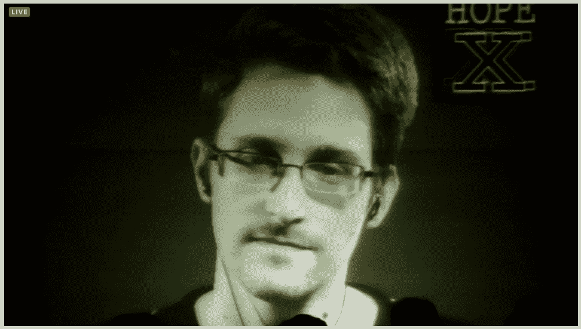

# 希望 X:采访埃尔斯伯格和斯诺登

> 原文：<https://hackaday.com/2014/07/19/hope-x-whistleblower-central/>

周六在 HOPE X 的两次会谈都围绕着丹尼尔·埃尔斯伯格和爱德华·斯诺登。除非你一直生活在岩石下，否则你一定听说过[斯诺登](http://en.wikipedia.org/wiki/Edward_Snowden)，他向几家媒体泄露了数千份美国国家安全局机密文件。年长的读者可能还记得[埃尔斯伯格](http://en.wikipedia.org/wiki/Daniel_Ellsberg)，他公布了政府文件，也就是众所周知的五角大楼文件，关于越战期间的政府决策。这在这里是一个受欢迎的话题，因为所有三个会议室都是专门用于会谈的，三个会议室都被完全填满，以至于工作人员不得不再次拒绝人们。幸运的是，即使你不能进入会议室，你仍然可以观看，因为所有的演讲都通过 HOPE 网站进行现场直播。

不管你觉得这两个人是英雄还是叛徒，他们讲述的故事都很有趣。每次采访大约一个小时。

亲自来到这里的埃尔斯伯格讲述了他的整个经历，以及为什么他觉得有必要披露他秘密复制的机密文件。即使埃尔斯伯格确实公布了他认为是政府知道这场战争很可能不会获胜并且会造成更多伤亡的证据，他仍然认为有些事情政府有必要保密。他估计，95%的机密文件在创建时是过度机密的，几年后，这些文件中只有 0.5%仍然是正确机密的，其余 99.5%仍然是过度机密的。

视频中的斯诺登受到了与会者的热烈欢迎和掌声。在谈话中，他谈到，他不认为他所知道的 NSA 的一些行动是符合宪法的，特别是收集大量数据，不仅包括“相关人员”，还包括普通美国公民。斯诺登觉得，我们作为一个社区，对我们的电子设备给予了太多的信任。他继续建议人们尽可能减少组织监控通信和跟踪数据的能力。他敦促有能力的人帮助教育他人如何安全、可靠地与技术互动，以服务于所有人的利益，而不仅仅是少数人的利益。

请在下面的评论中告诉我们你的想法。

